# APM Plan

## Workers

| Worker | Domain | Description |
|---|---|---|
| TDA Agent | Persistent homology, null batteries, diagram-level statistics, Mapper, code-side fixes to topology pipeline | All persistence-diagram computation (W₂, landscape L², stratified Markov-1, threshold/intrinsic-dim, H₂, KDE H₀, ε* knee, Mapper threshold), plus code-level fixes to `permutation_nulls.py`, `vectorisation.py`, `spanning_pipeline.py`, `run_wasserstein_battery.py`. Python 3.13 + `gudhi`/`ripser`/`persim`. Note: `giotto-tda` removed from the locked environment (no cp313 wheels); `scikit-tda` meta-package not resolvable (components `ripser` and `persim` pinned directly); any `gtda.*` imports in pipeline code must be replaced with direct `gudhi`/`ripser` equivalents. |
| Panel Statistics Agent | Sample construction, weighting, MICE, GLMM, Firth, mediation, ARI/null-test, demographic balance | All R2 + R3 issues that operate on the analytical sample or the regression model: Tier 1/2/3 cross-classified GLMM with Firth, sibling-consistent MICE for parental NS-SEC, MICE for income, two-stage IPW, Manski bounds, BIC curve, ARI normalisation, demographic balance, sparse-U sensitivity, harmonised-dataset verification (S4 jbstat, S12 income), sibling-cluster construction from `xhhrel`. R-driven with thin Python wrappers; libraries `lme4`, `glmmTMB`, `logistf`, `mice`, `survey`, `igraph`. |
| Reproducibility Agent | Locked environment, deterministic seed propagation, two-machine determinism, repo extraction | `uv.lock` pinning, BLAS thread pinning, RNG audit across the pipeline, two-machine bit-for-bit verification, headline-number provenance tables, standalone repo extraction with locked env + code subset + data pointer + replication script + README. |
| Academic Writing Agent | v2 drafts, supplements, figures to JRSS spec, notation-check at every change, humanizer | All prose rewrites of P01-A and P01-B sections, supplements, figures regenerated to `statsoc.cls` specifications, `papers/shared/notation.md` updates, `_project.md` updates, `/notation-check` step embedded in every prose Task, `/humanizer` pass at draft completion. |

## Stages

| Stage | Name | Tasks | Agents |
|---|---|---|---|
| 0 | Foundation | 11 | TDA, Panel Statistics, Reproducibility |
| 1 | Locked numerical and statistical results | 28 | TDA, Panel Statistics |
| 2 | v2 drafting | 22 | Academic Writing |
| 3 | Reproducibility extraction | 4 | Reproducibility |
| 4 | Option A full re-extraction | 10 | Panel Statistics, TDA, Academic Writing, Reproducibility |

## Dependency Graph

```mermaid
graph TB

subgraph S0["Stage 0: Foundation"]
  direction LR
  T0_1["0.1 Lock Python env<br/><i>Reproducibility Agent</i>"] --> T0_2["0.2 RNG audit<br/><i>Reproducibility Agent</i>"]
  T0_2 --> T0_3["0.3 Two-machine determinism<br/><i>Reproducibility Agent</i>"]
  T0_4["0.4 Markov-2 Laplace fix<br/><i>TDA Agent</i>"]
  T0_5["0.5 Regime-label bug fix<br/><i>TDA Agent</i>"]
  T0_6["0.6 ε* knee algorithm<br/><i>TDA Agent</i>"]
  T0_7["0.7 W₂ ground-metric audit<br/><i>TDA Agent</i>"]
  T0_8["0.8 W₂ test construction fix<br/><i>TDA Agent</i>"]
  T0_9["0.9 jbstat verification<br/><i>Panel Statistics Agent</i>"]
  T0_10["0.10 Income concept verification<br/><i>Panel Statistics Agent</i>"]
  T0_11["0.11 Sibling clusters from xhhrel<br/><i>Panel Statistics Agent</i>"]
end

subgraph S1["Stage 1: Locked numerical and statistical results"]
  direction LR
  T1_1["1.1 Pre-registrations<br/><i>TDA Agent</i>"] --> T1_2["1.2 Matched-L W₂ + landscape<br/><i>TDA Agent</i>"]
  T1_1 --> T1_3["1.3 Stratified Markov-1<br/><i>TDA Agent</i>"]
  T1_1 --> T1_4["1.4 Threshold + intrinsic dim<br/><i>TDA Agent</i>"]
  T1_2 --> T1_5["1.5 H₂ + pos control + 2n W₂<br/><i>TDA Agent</i>"]
  T1_2 --> T1_6["1.6 BHPS H4 diagnostics<br/><i>TDA Agent</i>"]
  T1_2 --> T1_7["1.7 BHPS H1 length-matched<br/><i>TDA Agent</i>"]
  T1_2 --> T1_8["1.8 Markov-2 α sweep<br/><i>TDA Agent</i>"]
  T1_1 --> T1_9["1.9 Spanning AUC + W₂ + ε*<br/><i>TDA Agent</i>"]
  T1_2 --> T1_10["1.10 Mapper threshold sweep<br/><i>TDA Agent</i>"]
  T1_1 --> T1_11["1.11 KDE sub-level H₀<br/><i>TDA Agent</i>"]
  T1_12["1.12 BIC curve<br/><i>Panel Statistics Agent</i>"]
  T1_13["1.13 Two-stage IPW<br/><i>Panel Statistics Agent</i>"]
  T1_14["1.14 MICE for income<br/><i>Panel Statistics Agent</i>"]
  T1_15["1.15 Manski bounds<br/><i>Panel Statistics Agent</i>"]
  T1_13 --> T1_16["1.16 Weighted-bootstrap TDA<br/><i>Panel Statistics Agent</i>"]
  T1_17["1.17 Demographic balance<br/><i>Panel Statistics Agent</i>"]
  T1_18["1.18 Sibling-consistent MICE NS-SEC<br/><i>Panel Statistics Agent</i>"]
  T1_19["1.19 Tier 1 regression<br/><i>Panel Statistics Agent</i>"] --> T1_20["1.20 Tier 2 regression<br/><i>Panel Statistics Agent</i>"]
  T1_20 --> T1_21["1.21 Tier 3 regression<br/><i>Panel Statistics Agent</i>"]
  T1_18 --> T1_21
  T1_21 --> T1_22["1.22 Mediation decomposition<br/><i>Panel Statistics Agent</i>"]
  T1_23["1.23 ARI normalisation<br/><i>Panel Statistics Agent</i>"]
  T1_24["1.24 Stability + escape CIs<br/><i>Panel Statistics Agent</i>"]
  T1_25["1.25 Sparse U-state 6vs9<br/><i>Panel Statistics Agent</i>"]
  T1_26["1.26 BHPS non-overlap<br/><i>Panel Statistics Agent</i>"]
  T1_27["1.27 10-of-14 sensitivity GMM<br/><i>Panel Statistics Agent</i>"]
  T1_28["1.28 FDR families redefine<br/><i>Panel Statistics Agent</i>"]
end

subgraph S2["Stage 2: v2 drafting"]
  direction LR
  T2_1["2.1 P01-A §3.2+§3.3 methods<br/><i>Academic Writing Agent</i>"]
  T2_2["2.2 P01-A §4.2 H₀+H₂<br/><i>Academic Writing Agent</i>"]
  T2_3["2.3 P01-A §4.3 Table 1+narrative<br/><i>Academic Writing Agent</i>"]
  T2_4["2.4 P01-A §4.5 regression<br/><i>Academic Writing Agent</i>"]
  T2_5["2.5 P01-A §4.6 ARI+Tables 2/3<br/><i>Academic Writing Agent</i>"]
  T2_6["2.6 P01-A §5 Mapper audit<br/><i>Academic Writing Agent</i>"]
  T2_7["2.7 P01-A §6.1 stratified W₂<br/><i>Academic Writing Agent</i>"]
  T2_8["2.8 P01-A §6.2 BHPS rewrite<br/><i>Academic Writing Agent</i>"]
  T2_3 --> T2_9["2.9 P01-A §7+§8+abstract<br/><i>Academic Writing Agent</i>"]
  T2_4 --> T2_9
  T2_8 --> T2_9
  T2_10["2.10 P01-A supplement<br/><i>Academic Writing Agent</i>"]
  T2_11["2.11 P01-A figures JRSS<br/><i>Academic Writing Agent</i>"]
  T2_12["2.12 P01-B §3.1<br/><i>Academic Writing Agent</i>"]
  T2_13["2.13 P01-B §3.2<br/><i>Academic Writing Agent</i>"]
  T2_14["2.14 P01-B §3.3<br/><i>Academic Writing Agent</i>"]
  T2_15["2.15 P01-B §3.4<br/><i>Academic Writing Agent</i>"]
  T2_16["2.16 P01-B §4.2<br/><i>Academic Writing Agent</i>"]
  T2_17["2.17 P01-B §4.3<br/><i>Academic Writing Agent</i>"]
  T2_18["2.18 P01-B §5 reproducibility<br/><i>Academic Writing Agent</i>"]
  T2_16 --> T2_19["2.19 P01-B §6+abstract<br/><i>Academic Writing Agent</i>"]
  T2_20["2.20 P01-B supplement<br/><i>Academic Writing Agent</i>"]
  T2_21["2.21 P01-B figures JRSS<br/><i>Academic Writing Agent</i>"]
  T2_22["2.22 humanizer + final notation<br/><i>Academic Writing Agent</i>"]
end

subgraph S3["Stage 3: Reproducibility extraction"]
  direction LR
  T3_1["3.1 Extract P01-A repo<br/><i>Reproducibility Agent</i>"] --> T3_3["3.3 Two-machine repo verification<br/><i>Reproducibility Agent</i>"]
  T3_2["3.2 Extract P01-B repo<br/><i>Reproducibility Agent</i>"] --> T3_3
  T3_1 --> T3_4["3.4 Provenance tables<br/><i>Reproducibility Agent</i>"]
  T3_2 --> T3_4
end

subgraph S4["Stage 4: Option A full re-extraction"]
  direction LR
  T4_1["4.1 Implement 10-of-14 rule<br/><i>Panel Statistics Agent</i>"] --> T4_2["4.2 Re-extract sample + descriptives<br/><i>Panel Statistics Agent</i>"]
  T4_3["4.3 Re-embed PCA-20D<br/><i>TDA Agent</i>"] --> T4_4["4.4 Refit GMM + ARI<br/><i>TDA Agent</i>"]
  T4_4 --> T4_5["4.5 Full null battery<br/><i>TDA Agent</i>"]
  T4_4 --> T4_6["4.6 Mapper on new sample<br/><i>TDA Agent</i>"]
  T4_7["4.7 Tiers 1/2/3 on new sample<br/><i>Panel Statistics Agent</i>"]
  T4_8["4.8 v3 draft update<br/><i>Academic Writing Agent</i>"] --> T4_9["4.9 Supplement updates<br/><i>Academic Writing Agent</i>"]
  T4_10["4.10 Repo updates<br/><i>Reproducibility Agent</i>"]
end

T0_1 -.-> T0_4
T0_1 -.-> T0_5
T0_1 -.-> T0_6
T0_1 -.-> T0_7
T0_1 -.-> T0_8
T0_1 -.-> T0_9
T0_1 -.-> T0_10
T0_1 -.-> T0_11
T0_5 --> T1_1
T0_4 -.-> T1_8
T0_6 -.-> T1_9
T0_7 -.-> T1_2
T0_8 -.-> T1_2
T0_11 -.-> T1_18
T0_9 -.-> T1_13
T0_10 -.-> T1_14
T1_2 -.-> T1_28
T1_2 -.-> T1_26
T1_2 -.-> T2_1
T1_2 -.-> T2_3
T1_2 -.-> T2_14
T1_2 -.-> T2_16
T1_2 -.-> T2_18
T1_3 -.-> T2_3
T1_3 -.-> T2_13
T1_3 -.-> T2_16
T1_4 -.-> T2_1
T1_4 -.-> T2_12
T1_5 -.-> T2_1
T1_5 -.-> T2_2
T1_5 -.-> T2_12
T1_6 -.-> T2_8
T1_7 -.-> T2_3
T1_7 -.-> T2_8
T1_8 -.-> T2_13
T1_8 -.-> T2_16
T1_9 -.-> T2_15
T1_9 -.-> T2_17
T1_10 -.-> T2_6
T1_11 -.-> T2_2
T1_13 -.-> T2_4
T1_14 -.-> T2_4
T1_15 -.-> T2_4
T1_17 -.-> T2_15
T1_17 -.-> T2_17
T1_21 -.-> T2_4
T1_22 -.-> T2_4
T1_23 -.-> T2_5
T1_24 -.-> T2_5
T1_26 -.-> T2_8
T1_28 -.-> T2_7
T0_1 -.-> T2_18
T0_3 -.-> T2_18
T2_10 -.-> T3_1
T2_11 -.-> T3_1
T2_22 -.-> T3_1
T2_20 -.-> T3_2
T2_21 -.-> T3_2
T2_22 -.-> T3_2
T1_27 --> T4_1
T4_2 -.-> T4_3
T4_4 -.-> T4_7
T4_5 -.-> T4_8
T4_7 -.-> T4_8
T4_9 -.-> T4_10

style T0_1 fill:#a8dadc,color:#000
style T0_2 fill:#a8dadc,color:#000
style T0_3 fill:#a8dadc,color:#000
style T0_4 fill:#2d6a4f,color:#000
style T0_5 fill:#2d6a4f,color:#000
style T0_6 fill:#2d6a4f,color:#000
style T0_7 fill:#2d6a4f,color:#000
style T0_8 fill:#2d6a4f,color:#000
style T0_9 fill:#f4a261,color:#000
style T0_10 fill:#f4a261,color:#000
style T0_11 fill:#f4a261,color:#000
style T1_1 fill:#2d6a4f,color:#000
style T1_2 fill:#2d6a4f,color:#000
style T1_3 fill:#2d6a4f,color:#000
style T1_4 fill:#2d6a4f,color:#000
style T1_5 fill:#2d6a4f,color:#000
style T1_6 fill:#2d6a4f,color:#000
style T1_7 fill:#2d6a4f,color:#000
style T1_8 fill:#2d6a4f,color:#000
style T1_9 fill:#2d6a4f,color:#000
style T1_10 fill:#2d6a4f,color:#000
style T1_11 fill:#2d6a4f,color:#000
style T1_12 fill:#f4a261,color:#000
style T1_13 fill:#f4a261,color:#000
style T1_14 fill:#f4a261,color:#000
style T1_15 fill:#f4a261,color:#000
style T1_16 fill:#f4a261,color:#000
style T1_17 fill:#f4a261,color:#000
style T1_18 fill:#f4a261,color:#000
style T1_19 fill:#f4a261,color:#000
style T1_20 fill:#f4a261,color:#000
style T1_21 fill:#f4a261,color:#000
style T1_22 fill:#f4a261,color:#000
style T1_23 fill:#f4a261,color:#000
style T1_24 fill:#f4a261,color:#000
style T1_25 fill:#f4a261,color:#000
style T1_26 fill:#f4a261,color:#000
style T1_27 fill:#f4a261,color:#000
style T1_28 fill:#f4a261,color:#000
style T2_1 fill:#cdb4db,color:#000
style T2_2 fill:#cdb4db,color:#000
style T2_3 fill:#cdb4db,color:#000
style T2_4 fill:#cdb4db,color:#000
style T2_5 fill:#cdb4db,color:#000
style T2_6 fill:#cdb4db,color:#000
style T2_7 fill:#cdb4db,color:#000
style T2_8 fill:#cdb4db,color:#000
style T2_9 fill:#cdb4db,color:#000
style T2_10 fill:#cdb4db,color:#000
style T2_11 fill:#cdb4db,color:#000
style T2_12 fill:#cdb4db,color:#000
style T2_13 fill:#cdb4db,color:#000
style T2_14 fill:#cdb4db,color:#000
style T2_15 fill:#cdb4db,color:#000
style T2_16 fill:#cdb4db,color:#000
style T2_17 fill:#cdb4db,color:#000
style T2_18 fill:#cdb4db,color:#000
style T2_19 fill:#cdb4db,color:#000
style T2_20 fill:#cdb4db,color:#000
style T2_21 fill:#cdb4db,color:#000
style T2_22 fill:#cdb4db,color:#000
style T3_1 fill:#a8dadc,color:#000
style T3_2 fill:#a8dadc,color:#000
style T3_3 fill:#a8dadc,color:#000
style T3_4 fill:#a8dadc,color:#000
style T4_1 fill:#f4a261,color:#000
style T4_2 fill:#f4a261,color:#000
style T4_3 fill:#2d6a4f,color:#000
style T4_4 fill:#2d6a4f,color:#000
style T4_5 fill:#2d6a4f,color:#000
style T4_6 fill:#2d6a4f,color:#000
style T4_7 fill:#f4a261,color:#000
style T4_8 fill:#cdb4db,color:#000
style T4_9 fill:#cdb4db,color:#000
style T4_10 fill:#a8dadc,color:#000
```

---

> **Notes:**
>
> - **Sequencing rationale.** The five Stages reflect hard precedence: locked-environment reproducibility (Stage 0) gates every Stage 1 numerical output; data analysis (Stage 1) gates prose for the same section (Stage 2) per the User's "no speculative paths" rule; repos (Stage 3) point to final v2 numerical claims; Option A (Stage 4) is the post-v2 follow-on per the Spec.
> - **Critical path.** Task 0.5 (regime-label bug fix) → Task 1.3 (stratified Markov-1) → Task 2.3 (P01-A §4.3 narrative) → Task 3.1 (P01-A repo) → Task 4.5 (full battery on Option A sample) → Task 4.8 (v3 draft) → Task 4.10 (repo update) is the longest cross-Worker chain. The H2 stratified Markov outcome A/B/C decision in Task 1.3 has the highest downstream prose impact.
> - **Stage 1 parallel-dispatch opportunities.** Once Stage 0 completes, the 11 TDA Tasks split into a small chain (1.1 → 1.2/1.3/1.4 → 1.5–1.10 fanout) and the 17 Panel-Statistics Tasks split into a parallel set of mostly independent runs (1.12, 1.13, 1.14, 1.15, 1.17, 1.18 in parallel; 1.19 → 1.20 → 1.21 sequential build-up; 1.22 follows 1.21; etc.). The Manager can dispatch TDA + Panel-Statistics work concurrently across multi-terminal compute (per User-confirmed concurrent-dispatch availability) for substantial wall-clock savings.
> - **Stage 2 parallelism is gated by per-section User review.** Multiple section drafts can proceed in parallel, but each Task's validation includes a "User per-section review" step. The Manager should expect serialised User-review bandwidth even where Tasks are parallel-dispatchable.
> - **Convergence points.**
>   - Task 1.3 (stratified Markov outcome) is the most consequential — it gates §4.3 prose direction in P01-A (Task 2.3) and §4.2.4 in P01-B (Task 2.16) plus the abstract reframing in both papers (Task 2.9, Task 2.19).
>   - Task 0.5 (regime-label fix) is the highest-impact Stage 0 fix — it unblocks Task 1.3 and the entire stratified-Markov chain. It also depends on Task 0.1's sklearn pin.
>   - Task 2.22 (humanizer + final notation sweep + `_project.md` update) is the v2-completion gate that unblocks Stage 3.
> - **Stage 3 holistic verification.** Task 3.3 (two-machine reproducibility on extracted repos) is the holistic gate before submission preparation; the Manager handles this as a milestone-level acceptance check rather than as a per-Task validation.
> - **Outcome-contingent prose is locked at runtime.** Tasks 1.3 (H2 A/B/C), 1.6 (H4 a/b/c), 1.7 (BHPS H1 length-matched), 1.9 (M3 ε* knee), 0.7 (H1 ℓ∞) each lock a prose direction via vault `[DECISION]` entries. The Manager should ensure these locks are written before the corresponding Stage 2 Tasks dispatch.
> - **JRSS formatting questions for User.** Tasks 2.11 and 2.21 (JRSS-spec figures) and Tasks 2.10, 2.20 (supplements) will surface format questions to the User in-Task: figure dimensions for single-column vs two-column, font family, line-weights, colour vs greyscale policy, supplement page-limit policy, citation style under `rss.bst` for grey literature. The Manager should not block on these; surface them as Task-embedded User prompts.
> - **Pre-registration timing.** Outcome-contingent decision rules go into vault `04-Methods/Computational-Log.md` *before* the corresponding run. Tasks 1.1, 0.7, and any Stage 4 outcome-contingent runs include explicit pre-registration steps. The Manager should not dispatch these runs without confirming the pre-registration is on file.
> - **Wall-clock budget signals from response plans.** P01-A response plan §11.3 estimates ~70–110h sequential compute for the canonical numerical battery; concurrent multi-terminal dispatch (User-confirmed) can roughly halve that. Stage 1 dispatch should exploit this. Tasks 1.5 (H₂) and 1.4 (threshold sweep) are the longest-running individual Tasks and benefit most from parallel-terminal dispatch.
> - **Workload distribution.** TDA Agent ~21 Tasks (heavy compute), Panel Statistics Agent ~22 Tasks (R-driven regression and survey methodology), Academic Writing Agent ~12 Tasks (section-by-section drafting), Reproducibility Agent ~7 Tasks (infrastructure + extraction). Stage 1 dispatches the heaviest work (~28 Tasks); Stage 2 dispatches the most User-coordinated work (~22 Tasks with per-section approvals).
> - **Vault-MCP-only access.** Workers and the Manager use `vault-engine` MCP tools (`vault_get`, `vault_query`, `vault_observe`); direct filesystem reads of the vault path will not be available.
> - **Reference-only `.apm-archive/`.** Workers should not modify or extract from the archived v0.5.3 APM state.

## Stage 0: Foundation

### Task 0.1: Lock the Python environment - Reproducibility Agent

* **Objective:** Capture a deterministic Python environment via `uv.lock` + `pyproject.toml` snapshot, pinned to specific patch versions of Python 3.13, gudhi, ripser, scikit-learn, persim, scikit-tda, numpy, scipy, plus BLAS thread environment variables.
* **Output:** `pyproject.toml` snapshot committed; `uv.lock` committed; documentation of `MKL_NUM_THREADS=1` and `OMP_NUM_THREADS=1`; vault `[PIPELINE]` entry recording the lock.
* **Validation:** `uv sync` from the lock produces identical hashes on a clean directory; sklearn version is set to one that loads existing GMM checkpoints without label collapse; Python is exactly 3.13.X for a specific X. Verified by running `uv run python -c "import sklearn; print(sklearn.__version__)"` and matching the pinned version.
* **Guidance:** See Spec §"Locked Python environment". Pin sklearn to a version known to load the existing GMM checkpoint without label collapse — the diagnosis of which version this should be may interact with Task 0.5; if Task 0.5 proves the existing checkpoint cannot be loaded under any sklearn version, the GMM is refit under the locked environment as part of Task 0.5.
* **Dependencies:** None.

1. Audit current `pyproject.toml` to identify floating versions.
2. Pin Python 3.13.X to a specific patch version.
3. Pin gudhi, ripser, persim, scikit-tda, scikit-learn, numpy, scipy, plus all transitive dependencies via `uv lock`.
4. Document `MKL_NUM_THREADS=1`, `OMP_NUM_THREADS=1` in a `.env` or activation hook.
5. Validate clean install on a temporary directory.
6. Write vault `[PIPELINE]` entry via `vault_observe` recording the lock decision and pinned versions.

### Task 0.2: Deterministic seed propagation audit - Reproducibility Agent

* **Objective:** Identify and fix every unseeded RNG call in the pipeline so a master seed deterministically propagates to all stochastic steps (maxmin landmark selection, surrogate generation, null-null pair sampling, GMM initialisation, MICE iterations).
* **Output:** Audit report listing each RNG call site (file:line, current state, fix applied); patches to `permutation_nulls.py`, `trajectory_ph.py`, `run_wasserstein_battery.py`, and any other scripts containing unseeded `np.random.default_rng()` or equivalent calls; vault `[PIPELINE]` entry.
* **Validation:** A search for unseeded `np.random` or `numpy.random` calls in `trajectory_tda/` and `shared/` returns no occurrences in production code paths; a canary script run twice produces bit-identical output for both H₀ and H₁ persistence values at L=500.
* **Guidance:** Use `vexp run_pipeline` or jcodemunch `search_text` to locate RNG calls; the project policy is to use vexp tooling for code exploration, not direct grep. The fix pattern is to thread a `seed` parameter through function signatures and use `np.random.default_rng(seed)` exclusively rather than module-level state. See Spec §"Deterministic seed propagation".
* **Dependencies:** Task 0.1.

1. Run `run_pipeline({"task": "audit RNG calls in trajectory_tda topology and scripts"})` to locate all RNG sites.
2. For each site, classify: production path (must be seeded) vs test/scratch (lower priority).
3. Patch each unseeded production-path call to accept a seed parameter and use `np.random.default_rng(seed)`.
4. Run a small canary script (L=500 Markov-1 W₂ at n_perms=20) twice and diff the outputs to confirm bit-identical results.
5. Write vault `[PIPELINE]` entry via `vault_observe` summarising the audit and fixes.

### Task 0.3: Two-machine bit-for-bit determinism check - Reproducibility Agent

* **Objective:** Verify the locked environment produces identical numerical outputs on the local i7 machine and a second machine.
* **Output:** Two results files from a small canary computation (L=500 Markov-1 W₂ at n_perms=20) at `results/trajectory_tda_integration/repro/canary_<machine>_<date>.json` with checksum-comparison note; vault `[DECISION]` entry locking the environment.
* **Validation:** `sha256sum` of both JSON outputs matches exactly. If they differ, the divergence source is documented and a follow-up pin (BLAS variant, threading library, etc.) is added to the lockfile and the test re-run until agreement holds.
* **Guidance:** The User has confirmed a second machine is available for this check. **User coordination required:** confirm the second machine is provisioned, install `uv` and clone the repo on it, run the canary script, and ship the results JSON back for comparison.
* **Dependencies:** Task 0.1, Task 0.2.

1. Coordinate with User to confirm second machine is ready, install `uv`, clone the repo at the locked commit, and provision the locked environment via `uv sync`.
2. Run the canary script on the local i7 and save outputs.
3. Run the canary script on the second machine and ship the outputs back.
4. `sha256sum` the two outputs and diff.
5. If divergence: document, add pin (BLAS variant, etc.), re-test from step 2.
6. Write vault `[DECISION]` entry via `vault_observe` locking the environment as reproducible.

### Task 0.4: Code-side fix - Markov-2 Laplace smoothing - TDA Agent

* **Objective:** Modify `permutation_nulls.py:168–234` to add α=1 Laplace smoothing on Markov-2 conditional probabilities, replacing the current uniform-fallback implementation, so the code matches the prose intent stated in P01-B §3.2.
* **Output:** Patch to `permutation_nulls.py` adding `(counts + alpha) / (total + alpha * n_states)` for all observed bigrams; new tests in `tests/trajectory_tda/test_markov2_smoothing.py`; vault `[PIPELINE]` entry.
* **Validation:** Unit tests confirm the surrogate transition matrix sums to 1 along each conditioning axis; observed-bigram cells now use smoothed estimates (not raw MLE); unobserved-bigram cells use the smoothed-uniform fallback; `alpha` is a parameter of the function with default 1.
* **Guidance:** See Spec §"Markov-2 null with explicit Laplace smoothing". The α-sensitivity sweep over {0, 0.5, 1, 5} is performed in Task 1.8.
* **Dependencies:** Task 0.2.

1. Use `vexp get_skeleton` to inspect `permutation_nulls.py` lines 168–234.
2. Read the relevant section of `permutation_nulls.py` for editing.
3. Edit the bigram-probability assignment to use the smoothed formula, with `alpha` as a parameter.
4. Add unit tests covering smoothed transition matrix, observed vs unobserved cells, edge cases.
5. Run the new tests via `uv run pytest tests/trajectory_tda/test_markov2_smoothing.py`.
6. Write vault `[PIPELINE]` entry via `vault_observe`.

### Task 0.5: Diagnose stratified-Markov regime-label collapse bug - TDA Agent

* **Objective:** Identify why `_stratified_markov_shuffle()` collapsed to 2 effective regimes in the legacy run; fix the root cause; confirm the corrected pipeline produces a regime distribution matching the v1 P01-A Table 2.
* **Output:** `papers/P01-A-JRSSA/notes/2026-XX-XX-stratified-markov-diagnosis.md` documenting the bug and fix; corrected GMM regime-label artefact (refit under the locked environment if checkpoint loading fails); corrected stratified-Markov surrogate generator; vault `[PIPELINE]` entry.
* **Validation:** Loading the GMM produces 7 regimes (USoc) / 8 regimes (BHPS) with counts approximately matching v1 Table 2 (R1: 7,358; R2: 5,415; R0: 3,787; R4: 3,510; R3: 3,333; R6: 2,064; R5: 1,813); a stratified-Markov surrogate run at small n_perms=10 shows all regimes represented in the surrogate trajectories.
* **Guidance:** See P01-A response plan §2 (H2). Likely root cause is sklearn version mismatch (resolved in Task 0.1) but verify; alternative causes are wrong checkpoint field provenance or embedding/GMM misalignment. Use `vexp` to inspect `_stratified_markov_shuffle()` in `permutation_nulls.py:246–362`.
* **Dependencies:** Task 0.1, Task 0.2.

1. Reproduce the legacy bug under the unlocked environment to confirm symptom.
2. Re-run under the locked environment from Task 0.1; observe whether the bug persists.
3. If persistent: inspect checkpoint field provenance (which field carries regime labels) and embedding alignment (was GMM fit on the same embedding the null run uses?).
4. If checkpoint cannot be loaded under any sklearn version, refit GMM at k=7 (USoc) / k=8 (BHPS) under the locked environment and persist a fresh checkpoint.
5. Apply fix (whichever root cause is identified).
6. Verify regime distribution against v1 Table 2.
7. Write the diagnostic note in `papers/P01-A-JRSSA/notes/`.
8. Write vault `[PIPELINE]` entry via `vault_observe`.

### Task 0.6: Code-side fix - ε* knee detection algorithm - TDA Agent

* **Objective:** Audit the implicit knee algorithm in `spanning_pipeline.py` / `run_zigzag_sensitivity.py`, formalise it as a named, parameterised function with explicit pseudocode, and verify the canonical ε*=0.70 used in §4.3.2 is reproducible from a documented derivation rule applied to the per-year knees in `knee_analysis.json`.
* **Output:** Patched `spanning_pipeline.py` with named knee-detection function; pseudocode extracted to a module docstring; vault `[PIPELINE]` entry; updated knee derivation note explaining the per-era median rule and the degeneracy criterion.
* **Validation:** Re-running the new function on existing 32-year input reproduces `knee_analysis.json` per-year values; ε*=0.70 is reproducible from a documented rule (e.g., "median of non-degenerate USoc-era knees rounded to nearest 0.05 grid value"); degeneracy criterion (e.g., `v > 0.1`) is named and parameterised.
* **Guidance:** See P01-B response plan §9 (M3) and Spec §"ε* knee detection".
* **Dependencies:** Task 0.2.

1. Use `vexp get_skeleton` to locate the existing implementation.
2. Read `spanning_pipeline.py` and the knee-related sections of `run_zigzag_sensitivity.py`.
3. Rewrite as a named function: discrete grid scan over precomputed values, identify smallest ε such that β₀ has decreased by ≥X% from maximum, exclude degenerate cases.
4. Verify reproduction of `knee_analysis.json`.
5. Document the derivation of ε*=0.70 in the function docstring and a separate note.
6. Write vault `[PIPELINE]` entry via `vault_observe`.

### Task 0.7: Code-side fix - W₂ ground-metric formula audit and ℓ∞ sensitivity check - TDA Agent

* **Objective:** Confirm `gudhi.wasserstein.wasserstein_distance(..., order=2, internal_p=2)` in `vectorisation.py:232` is the canonical implementation; verify the ℓ² ground metric matches the corrected §3.1 formula in P01-B; pre-register and run a single sensitivity comparison with `internal_p=inf` at L=2000, n=50.
* **Output:** Pre-registration vault entry (decision rule: qualitative agreement → ℓ² is canonical, disagreement → escalate to full ℓ∞ rerun); `results/trajectory_tda_integration/post_audit/04_nulls_wasserstein_w2_L2000_internal_pInf_<date>.json`; sensitivity-comparison report; post-run `[RESULT]` vault entry.
* **Validation:** Both ground metrics give the same direction (both reject or both fail to reject) for the Markov-1 H₀ test on USoc; if not, the implementation decision is escalated.
* **Guidance:** See Spec §"W₂ ground metric: ℓ²". The implementation does not change in this Task; the Task only confirms consistency and runs the empirical safety net.
* **Dependencies:** Task 0.1, Task 0.2.

1. Use `vexp` to read `vectorisation.py:232` and confirm the implementation.
2. Write pre-registration to vault Computational-Log via `vault_observe` with timestamp, parameters, and the qualitative-agreement decision rule.
3. Run `internal_p=inf` sensitivity comparison at L=2000, n=50 on USoc Markov-1 H₀.
4. Compare to the ℓ² result.
5. Write vault `[RESULT]` entry via `vault_observe`.
6. If qualitative disagreement: surface as a User decision point (out-of-Task escalation).

### Task 0.8: Code-side fix - W₂ test construction (mean-vs-mean with BCa CI) - TDA Agent

* **Objective:** Replace the anti-conservative mean-vs-individual W₂ test construction in `run_wasserstein_battery.py` with the mean-vs-mean construction T_ratio = mean(W_obs-null) / mean(W_null-null), with the 95% BCa CI implementation specified in P01-A response plan §B2.8 / §B2.9.
* **Output:** Patched `run_wasserstein_battery.py` and supporting helpers; new `compute_w2_ratio_bca_ci()` helper module in `shared/` or `trajectory_tda/topology/`; tests in `tests/trajectory_tda/test_w2_test_construction.py`; vault `[PIPELINE]` entry.
* **Validation:** Unit tests with synthetic null draws (n_obs=100, n_null-null=500) recover the analytical T_ratio and a delta-method CI within numerical tolerance; BCa CI computation runs without error on the synthetic input; full-matrix (Case A) and unindexed-pairs (Case B) inputs both supported.
* **Guidance:** See Spec §"W₂ test construction" and P01-A response plan §B2 (B2.5, B2.8, B2.9).
* **Dependencies:** Task 0.2.

1. Use `vexp get_skeleton` to read `run_wasserstein_battery.py`.
2. Implement `compute_w2_ratio_bca_ci()` supporting Case A (full B×B matrix) and Case B (unindexed pairs).
3. Modify the test driver to use the new construction.
4. Add unit tests covering both Case A and Case B.
5. Run tests via `uv run pytest tests/trajectory_tda/test_w2_test_construction.py`.
6. Write vault `[PIPELINE]` entry via `vault_observe`.

### Task 0.9: Verify harmonised dataset - jbstat cross-survey/wave consistency - Panel Statistics Agent

* **Objective:** Establish whether the harmonised UKDA-6614 dataset's `jbstat` coding is consistent across all UKHLS waves a–o and harmonised BHPS waves ba–br, and produce a per-wave coding map that confirms or contradicts the working assumption that S4 is intrinsically resolved.
* **Output:** `papers/shared/jbstat_harmonisation_audit.md` with per-wave coding tables; `results/panel_methodology/harmonisation/jbstat_coding_<date>.json`; vault `[RESULT]` (or `[NEGATIVE]` if material differences exist) entry.
* **Validation:** For every E/U/I bin used in the 9-state crossing, the per-wave codes that map to that bin are listed and consistent; any wave where the ILO-unemployment definition differs is flagged; zero-hours / gig contract handling per wave is documented.
* **Guidance:** See Spec §"`jbstat` harmonisation" and the harmonised-BHPS user guide at `data/UKDA-6614-tab/mrdoc/pdf/6614_bhps_harmonised_user_guide.pdf`. The User flagged this as an assumption to verify, not assume.
* **Dependencies:** Task 0.1.

1. Read the harmonised-BHPS user guide section on `jbstat` harmonisation rules.
2. Inspect `*_indresp.tab` for `jbstat` codes per wave (a–o and ba–br) — read schema documentation, not raw data unless necessary.
3. Build per-wave coding-to-bin map for the 9-state crossing.
4. Identify inconsistencies (waves where coding differs, ILO treatment differs, zero-hours/gig handling differs).
5. Write the audit document to `papers/shared/`.
6. Write vault `[RESULT]` (or `[NEGATIVE]`) entry via `vault_observe`.

### Task 0.10: Verify harmonised dataset - BHPS/USoc income concept reconciliation - Panel Statistics Agent

* **Objective:** Establish whether the harmonised dataset reconciles BHPS `fihhmn` (point-in-time net monthly) with USoc `fihhmnnet3_dv` (annualised monthly average), and verify the working assumption that S12 is intrinsically resolved.
* **Output:** `papers/shared/income_concept_audit.md` with per-survey income-variable definitions and the harmonised mapping; cross-era calibration check on the spanning sub-sample (last BHPS income band vs first USoc income band concordance rate) at `results/panel_methodology/harmonisation/income_calibration_<date>.json`; vault `[RESULT]` (or `[NEGATIVE]`) entry.
* **Validation:** The harmonised income variable is named and its derivation traced to source variables; concordance rate on spanning individuals is reported; if concordance < 80%, S12 is *not* intrinsically resolved and a follow-up Task is recorded as an open finding.
* **Guidance:** See Spec §"BHPS / USoc income concept reconciliation" and the harmonised-BHPS user guide. The User flagged this as an assumption to verify.
* **Dependencies:** Task 0.1.

1. Read the harmonised-BHPS user guide section on income harmonisation rules.
2. Identify the canonical harmonised income variable in `*_income.tab` per wave.
3. For the ~8,459 spanning individuals, compute concordance between last BHPS income band and first USoc income band.
4. Write the audit document to `papers/shared/`.
5. If concordance < 80%, note the open finding and surface as a User decision point.
6. Write vault `[RESULT]` (or `[NEGATIVE]`) entry via `vault_observe`.

### Task 0.11: Sibling cluster construction from xhhrel - Panel Statistics Agent

* **Objective:** Build family-of-origin (`foo_id`) clusters using `xhhrel.tab` as the primary source, supplemented by `xwavedat` `ppid`/`mpid` and wave-1 co-residence as fallbacks; report coverage on the analytical sample.
* **Output:** `data/derived/foo_clusters_<date>.csv` with columns `pidp`, `foo_id`, `n_siblings`, `source_method`; coverage report at `results/panel_methodology/foo_clustering/coverage_<date>.json`; FOO ICC pre-check via null GLMM (R script + JSON output); vault `[RESULT]` entry.
* **Validation:** Cluster construction is reproducible from `xhhrel.tab` + `xwavedat.tab`; coverage substantially exceeds the §S5.9 estimate (target: >50% of analytical sample, vs the §S5.9 baseline of 10–15%); ICC point estimate reported with bootstrap CI.
* **Guidance:** See Spec §"Family-of-origin clustering uses `xhhrel.tab`". The user guide at `data/UKDA-6614-tab/mrdoc/pdf/6614_main_survey_user_guide_family_matrix_xhhrel.pdf` provides the canonical procedure including the `osm_hh` origin-household identifier. Use connected components via `igraph::components()` in R.
* **Dependencies:** Task 0.1.

1. Read the family-matrix user guide in detail; note the `osm_hh` semantics and the relationship enumeration logic.
2. Implement an R script reading `xhhrel.tab` + `xwavedat.tab` and constructing `foo_id` via connected components.
3. For individuals not covered by `xhhrel`, fall back to `ppid`/`mpid` from `xwavedat`, then to wave-1 co-residence.
4. Report coverage by source method and overall.
5. Run the FOO ICC null GLMM pre-check: `glmer(escaped ~ 1 + (1 | foo_id), data = analytic_sample, family = binomial)`.
6. Write the FOO clusters CSV.
7. Write vault `[RESULT]` entry via `vault_observe`.

## Stage 1: Locked numerical and statistical results

### Task 1.1: Outcome-contingent pre-registrations - TDA Agent

* **Objective:** Write four pre-registration entries to vault `04-Methods/Computational-Log.md` before the corresponding Stage 1 runs: H1 ℓ∞ ground-metric sensitivity formal-decision-rule registration; H2 stratified Markov A/B/C; M3 ε* knee robustness across {0.54, 0.65, 0.70, 0.80}; H4 BHPS negative-control three-hypothesis discrimination (a/b/c).
* **Output:** Four vault entries timestamped before runs, each specifying parameter values, decision rule, and the prose-direction rule for each outcome.
* **Validation:** Each entry contains parameter list, decision rule, prose-direction rule per outcome, and timestamp; subsequent `[RESULT]` entries reference the pre-registration.
* **Guidance:** See Spec §"Pre-registration discipline" and the response plans' decision-rule sections (P01-A response plan §2.4, §6.4, §9.4 + P01-B response plan §6.4).
* **Dependencies:** Task 0.5.

1. Draft pre-registration for H2 stratified Markov A/B/C: parameters L=5000, n_perms=100, both H₀ and H₁; decision rule p<0.05 → reject (outcome A), p≥0.20 → fail to reject (outcome B), 0.05–0.20 → borderline (outcome C); per-outcome prose direction.
2. Draft pre-registration for M3 ε* knee robustness: parameters ε* ∈ {0.54, 0.65, 0.70, 0.80}, three statistics (single-ε, AUC, W₂), decision rule for spanning-individual headline.
3. Draft pre-registration for H4 BHPS negative-control: three diagnostics (geometry KS test, variance CV + L=5000 rerun, calibration 100-trial double-null), decision rule per hypothesis.
4. (H1 ℓ∞ pre-registration already filed in Task 0.7; reference it here.)
5. Write all four entries via `vault_observe` to `04-Methods/Computational-Log.md` with timestamps.

### Task 1.2: Matched-L W₂ Markov-1 + landscape L² battery (USoc + BHPS) - TDA Agent

* **Objective:** Compute the canonical W₂ Markov-1 H₀ and H₁ tests at L=5,000, n_perms=1,000, under the locked environment, using the new mean-vs-mean test construction with BCa CI, on USoc and BHPS checkpoints; compute landscape L² in parallel; compute effect sizes ($d_\text{perm}$, W₂ ratio with 95% BCa CI).
* **Output:** `results/trajectory_tda_integration/post_audit/04_nulls_wasserstein_w2_L5000_<date>.json`; `results/trajectory_tda_bhps/post_audit/04_nulls_wasserstein_w2_L5000_<date>.json`; landscape L² counterparts; vault `[RESULT]` entry referencing the pre-registration.
* **Validation:** JSON files contain `T_ratio`, BCa CI lower/upper, mean obs-null, mean null-null, $d_\text{perm}$, full obs-null distribution, full null-null pairs; per-paper numerical claims trace to specific JSON keys.
* **Guidance:** See Spec §"Canonical landmark count: L = 5,000" and §"W₂ test construction". Reuse `run_wasserstein_battery.py` with `--landmarks 5000` after Task 0.8's patch. Concurrent multi-terminal dispatch (USoc on terminal A, BHPS on terminal B) is User-confirmed acceptable.
* **Dependencies:** Task 0.5, Task 0.7, Task 0.8, Task 1.1.

1. Confirm pre-registration is on file in vault.
2. Launch USoc battery on terminal A.
3. Launch BHPS battery on terminal B.
4. Compute landscape L² counterparts via `persistence_landscape()` with k_max=5, n_points=200.
5. Compute effect sizes ($d_\text{perm}$, T_ratio, BCa CI) using the helper from Task 0.8.
6. Write vault `[RESULT]` entry via `vault_observe`.

### Task 1.3: Stratified Markov-1 W₂ + landscape L² (USoc + BHPS); A/B/C decision - TDA Agent

* **Objective:** Run the corrected stratified Markov-1 surrogate at L=5,000, n_perms=1,000 (or 100 if budget binds), all regimes represented, both H₀ and H₁, on USoc and BHPS; compute W₂ and landscape L²; record outcome A/B/C against the pre-registered decision rule; lock the prose direction for §4.3 (P01-A) and §4.2.4 (P01-B).
* **Output:** `results/trajectory_tda_integration/stratified_markov/stratified_markov1_W2_L5000_<date>.json`; BHPS counterpart; landscape L² counterparts; vault `[RESULT]` entry plus `[DECISION]` lock on outcome A/B/C.
* **Validation:** Regime distribution in stratified surrogates matches v1 Table 2 within tolerance; outcome (A: stratified rejects p < 0.05, B: stratified does not reject p ≥ 0.20, C: borderline) is recorded against the pre-registration; if outcome C, the escalation to stratified Markov-2 is logged as an open finding.
* **Guidance:** See Spec §"Stratified Markov-1 ladder rung" and P01-A response plan §2 (H2). Save the legacy broken JSON; do not overwrite (CONVENTIONS).
* **Dependencies:** Task 0.5, Task 1.1.

1. Confirm pre-registration is on file.
2. Verify regime distribution sanity check by running the stratified surrogate at small n=10 and comparing regime counts.
3. Launch USoc stratified battery on terminal A.
4. Launch BHPS stratified battery on terminal B.
5. Compute landscape L² counterparts.
6. Decide outcome A/B/C against the pre-registration.
7. Write vault `[RESULT]` entry; write `[DECISION]` entry locking the outcome and prose direction.

### Task 1.4: Threshold sensitivity + intrinsic dimension + cross-landmark sensitivity table - TDA Agent

* **Objective:** Compute persistence diagrams and W₂ Markov-1 p-value at threshold percentiles {50, 75, 90} on USoc (and BHPS where feasible); estimate intrinsic dimension via Levina-Bickel and Facco et al. two-NN; compile the cross-landmark sensitivity table for L ∈ {2500, 5000, 8000} with both total persistence and W₂ p-values.
* **Output:** `results/trajectory_tda_robustness/threshold_sensitivity/ph_thresh_{p50,p75,p90}_L5000_<date>.json` (USoc + BHPS); `results/trajectory_tda_robustness/intrinsic_dimension/id_estimates_<date>.json`; `results/trajectory_tda_robustness/landmark_sensitivity/cross_landmark_table_<date>.json`; vault `[RESULT]` entry.
* **Validation:** All three thresholds produce valid persistence diagrams; intrinsic-dimension estimate reported with bootstrap CI; cross-landmark table covers both statistics for all five rungs of the original ladder plus the new stratified rung.
* **Guidance:** See Spec §"Filtration threshold justification" and P01-A response plan §6 (M3). Reuse existing `run_landmark_sensitivity.py` style.
* **Dependencies:** Task 0.5, Task 1.1.

1. Pre-registration for M3 ε* knee robustness was filed in Task 1.1; cross-reference here.
2. Threshold sweep on USoc at p50, p75, p90 with persistence + W₂ Markov-1 p-value.
3. Threshold sweep on BHPS (same).
4. Intrinsic-dimension estimates via Levina-Bickel and Facco et al. methods on the PCA-20D embedding.
5. Compile cross-landmark sensitivity table from existing landmark-sensitivity results plus W₂ at L ∈ {2500, 5000, 8000} (rerun where missing).
6. Write vault `[RESULT]` entry.

### Task 1.5: Auxiliary diagnostics - H₂ + positive control + doubled-n W₂ sanity - TDA Agent

* **Objective:** Three small but distinct numerical checks: (i) H₂ at L=2,000 with `maxdim=2`, plus a Markov-1 null at n=50; (ii) positive-control simulation (~27,280 trajectories from the fitted global Markov-1, full pipeline, expected p ≈ 0.5); (iii) doubled-n W₂ Markov-1 sanity check at n_perms=200, n_nullnull=2000.
* **Output:** `results/trajectory_tda_integration/h2_check/ph_H2_L2000_<date>.json` + Markov-1 null counterpart; `results/trajectory_tda_integration/positive_control/markov1_simulation_<date>.json`; `results/trajectory_tda_integration/post_audit/04_nulls_wasserstein_w2_L5000_doublen_<date>.json`; vault `[RESULT]` entries (one per diagnostic).
* **Validation:** H₂ feature count and total persistence reported; positive-control p ≈ 0.5 within tolerance (or flagged); doubled-n W₂ p stable vs Task 1.2 within Monte Carlo error.
* **Guidance:** See Spec §"H₂ check" and P01-A plan §10.2 + §B1 + §8. If H₂ at L=2000 takes >24h, fall back to L=1000 with documentation.
* **Dependencies:** Task 1.2.

1. Run H₂ at L=2000, `maxdim=2`; if >24h, fall back to L=1000.
2. Run positive-control simulation: generate trajectories from the fitted global Markov-1 chain, embed via the same n-gram + PCA-20D pipeline (frozen loadings), run the Markov-1 W₂ test.
3. Run doubled-n W₂ sanity at n_perms=200, n_nullnull=2000 (long-running; background dispatch).
4. Write three vault `[RESULT]` entries.

### Task 1.6: BHPS H4 negative-control three-hypothesis diagnostics - TDA Agent

* **Objective:** Run the three diagnostics that discriminate between geometry / variance-inflation / p-value-miscalibration as the cause of BHPS label-shuffle p ≈ 0.036; lock the explanation against the pre-registered decision rule.
* **Output:** `results/trajectory_tda_bhps/diagnostics/label_shuffle_geometry_check_<date>.json` (KS test of pairwise-distance distributions); `..._variance_check_<date>.json` (CV statistics + L=5000 rerun); `..._pvalue_calibration_<date>.json` (100-trial double-null p-value uniformity); diagnostic table; vault `[RESULT]` plus `[DECISION]` entry locking the explanation.
* **Validation:** All three hypotheses tested; the resulting explanation is locked against the pre-registration; the §4.2.3 prose direction in P01-B is determined.
* **Guidance:** See P01-B response plan §6 (H4) and Spec §"BHPS H4 negative-control hypothesis discrimination".
* **Dependencies:** Task 1.1, Task 1.2.

1. Geometry diagnostic: KS test of pairwise embedding-vector ℓ² distance distributions on observed BHPS vs a label-shuffled surrogate.
2. Variance diagnostic: compute null-null CV at L=2000 (existing) and at L=5000 (new rerun); compare USoc and BHPS CVs.
3. Calibration diagnostic: 100 double-null label-shuffle trials; KS-test the resulting p-value distribution against uniform(0,1).
4. Decide explanation against pre-registration.
5. Write vault `[RESULT]` and `[DECISION]` entries.

### Task 1.7: BHPS H1 length-matched analysis (truncation + first-13 windowing) - TDA Agent

* **Objective:** Construct length-matched BHPS sub-samples via two strategies (random truncation to ≤13y; first-13y windowing); recompute persistence at L=5,000; rerun Markov-1 W₂ H₁ test; lock the §6.2 prose direction.
* **Output:** `results/trajectory_tda_bhps/length_matched/ph_truncated13_L5000_<date>.json`; `..._first13_L5000_<date>.json`; null counterparts; back-of-envelope power calculation; vault `[RESULT]` entry.
* **Validation:** Both strategies run; H₁ p-values reported; power calculation reported; §6.2 prose direction (era-specific finding vs window-length artefact) is decided.
* **Guidance:** See P01-A response plan §9 (L3).
* **Dependencies:** Task 1.2.

1. Construct truncation sub-sample: for each BHPS trajectory of length T, randomly drop trailing years until length ≤ 13.
2. Construct first-13 sub-sample: take the first 13 years of each BHPS trajectory of length T ≥ 13.
3. Re-embed each sub-sample (frozen PCA loadings).
4. Compute persistence and Markov-1 W₂ H₁ test on each.
5. Power calculation as a function of n trajectories and trajectory length.
6. Write vault `[RESULT]` entry.

### Task 1.8: Markov-2 α sensitivity sweep - TDA Agent

* **Objective:** Run Markov-2 null at α ∈ {0, 0.5, 1, 5} on USoc and BHPS at L=5,000; report total persistence, W₂ obs-null, p-value at each α.
* **Output:** `results/trajectory_tda_integration/post_audit/04_nulls_markov2_smoothing_alpha{0,0.5,1,5}_L5000_<date>.json` (USoc); BHPS counterparts; sensitivity table; vault `[RESULT]` entry; if conclusion stable across α, a `[DECISION]` lock on α=1 as canonical.
* **Validation:** All four α values run; sensitivity table compiled; conclusion-stability assessment recorded.
* **Guidance:** Uses Task 0.4's smoothing implementation. See P01-B response plan §11 (M5).
* **Dependencies:** Task 0.4, Task 1.2.

1. Run Markov-2 null at α=0 (no smoothing) on USoc + BHPS.
2. Run α=0.5.
3. Run α=1 (canonical).
4. Run α=5 (strong smoothing).
5. Compile sensitivity table.
6. Write vault `[RESULT]` and (if stable) `[DECISION]` entries.

### Task 1.9: Spanning Betti AUC + W₂ alternatives + ε* robustness - TDA Agent

* **Objective:** Report spanning-individual Betti comparison in three forms — single-ε ratio, AUC ratio over full filtration, W₂(D₀(X_t^new), D₀(X_t^*)) at matched sample sizes — at ε* ∈ {0.54, 0.65, 0.70, 0.80}, using the formalised knee algorithm from Task 0.6.
* **Output:** `results/trajectory_tda_spanning/knee_robustness/spanning_betti_eps_{054,065,070,080}_<date>.json`; `..._spanning_AUC_W2_<date>.json`; vault `[RESULT]` entry.
* **Validation:** All three statistics computed at all four ε* values; pre-registered M3 decision rule applied; the spanning headline conclusion (newcomers > spanning) holds or fails consistently across statistics and ε*.
* **Guidance:** See P01-B response plan §9 (M3).
* **Dependencies:** Task 0.6, Task 1.1.

1. Single-ε runs at four ε* values.
2. AUC computation over full filtration [0, ε_max].
3. W₂ matched-sample-size computation between newcomer and spanning sub-populations.
4. Apply M3 decision rule against pre-registration.
5. Write vault `[RESULT]` entry.

### Task 1.10: Mapper threshold sensitivity sweep - TDA Agent

* **Objective:** Recompute Mapper sub-regime node count at |z| ∈ {1.0, 1.5, 2.0}; report B (number of permutations); apply BH correction to per-node z-scores for individual-node identification.
* **Output:** `results/trajectory_tda_integration/mapper_threshold/sub_regime_thresh_{1.0,1.5,2.0}_<date>.json`; per-node BH-adjusted flagging; vault `[RESULT]` entry.
* **Validation:** All three thresholds run; B reported; per-node flags consistent across thresholds for high-confidence sub-regime nodes.
* **Guidance:** See P01-A response plan §B12.
* **Dependencies:** Task 1.2.

1. Mapper threshold sweep at the three |z| values.
2. Per-node BH FDR correction.
3. Write vault `[RESULT]` entry.

### Task 1.11: KDE sub-level-set H₀ - density-mode positive complement - TDA Agent

* **Objective:** Compute sub-level-set persistence of a kernel-density estimator on the trajectory embedding (cubical filtration on a fixed grid, or DTM-Rips); report the H₀ persistence diagram and tree-cut at prominence consistent with k=7; compare to GMM regimes.
* **Output:** `results/trajectory_tda_integration/density_topology/sublevel_kde_h0_<date>.json`; ARI(KDE-tree-cut, GMM-regimes) reported; vault `[RESULT]` entry.
* **Validation:** KDE H₀ partitioning reported; ARI > 0.3 indicates substantial recovery (working hypothesis); vault entry records the comparison.
* **Guidance:** See P01-A response plan §3 (H3) — confirmed in scope per User confirmation.
* **Dependencies:** Task 1.1.

1. Build KDE on PCA-20D embedding with bandwidth chosen by Silverman's rule or cross-validation.
2. Cubical sub-level-set persistence on a fixed grid.
3. Tree-cut at k=7 prominence.
4. Compute ARI with GMM regimes.
5. Write vault `[RESULT]` entry.

### Task 1.12: BIC curve + ΔBIC interpretation - Panel Statistics Agent

* **Objective:** Compute the BIC curve over k ∈ {3, ..., 15} GMM components on the USoc PCA-20D embedding; report ΔBIC between k=7 and nearest competitors with Kass-Raftery interpretation.
* **Output:** `results/panel_methodology/bic_curve/bic_k3to15_<date>.json`; figure `papers/P01-A-JRSSA/figures/bic_curve.pdf` (JRSS-spec); vault `[RESULT]` entry.
* **Validation:** All k values run with reproducible seeds; ΔBIC reported; Kass-Raftery interpretation in JSON metadata; if ΔBIC(k=7, k=8) < 6, ARI(k=7, k=8) regime stability reported as a sensitivity note.
* **Guidance:** See P01-A response plan §B6.
* **Dependencies:** Task 0.1.

1. Fit GMM at each k with reproducible seeds.
2. Compute BIC.
3. Report ΔBIC between k=7 and k=6, k=8.
4. If ΔBIC < 6 vs k=8: compute ARI(k=7, k=8) regime maps.
5. Generate JRSS-spec BIC-curve figure.
6. Write vault `[RESULT]` entry.

### Task 1.13: Two-stage IPW weights - Panel Statistics Agent

* **Objective:** Construct the wave-level response propensity weight (`lwtresp` × observation-propensity) and the trajectory-level continuity propensity weight (probability of satisfying the 10-of-14 rule given wave-1 observables); combine and trim at 1st/99th percentile.
* **Output:** `results/panel_methodology/ipw/wave_propensity_<date>.json`; `..._trajectory_propensity_<date>.json`; combined weights at `data/derived/ipw_weights_<date>.csv`; weighted descriptive table; vault `[RESULT]` entry.
* **Validation:** Weights sum to roughly the analytical sample size; trimming caps reported; weighted regime proportions reported alongside unweighted (R2/R6 expected to expand, R1 expected to contract).
* **Guidance:** See P01-A response plan §S1.5 Component 2 and Spec §"Survey-weight handling for TDA".
* **Dependencies:** Task 0.1, Task 0.9.

1. Build wave-level propensity model in R using `lwtresp` and `indscub_xw` covariates.
2. Build trajectory-level continuity propensity model.
3. Combine: `w_i = w_i^USoc × w_i^continuity`; trim at 1st/99th percentile.
4. Compute weighted regime proportions and compare to unweighted.
5. Write vault `[RESULT]` entry.

### Task 1.14: MICE for income within observed waves - Panel Statistics Agent

* **Objective:** Multiple imputation (m=20) for income non-response within observed waves, predictors as in Spec §"Standard MICE for income within observed waves"; Rubin-pooled regime-membership and escape-rate estimates.
* **Output:** `results/panel_methodology/mice/income_mi_m20_<date>.rds`; pooled estimates JSON; complete-case versus pooled comparison; vault `[RESULT]` entry.
* **Validation:** Convergence diagnostics for each imputation chain reported; pooled estimates reported with Rubin-pooled SEs.
* **Guidance:** See P01-A response plan §S1.5 Component 3. Use `mice` in R.
* **Dependencies:** Task 0.1, Task 0.10.

1. Specify predictor set (prior/subsequent wave income, employment status, household composition, region/wave fixed effects).
2. Run MICE with m=20 imputations.
3. Convergence diagnostics.
4. Pool estimates via Rubin's rules.
5. Complete-case vs pooled comparison.
6. Write vault `[RESULT]` entry.

### Task 1.15: Manski bounds for permanent attritors - Panel Statistics Agent

* **Objective:** Worst-case bounds on regime proportions and escape rates under pessimistic assumptions about permanent attritors (all allocated to R2 or R6).
* **Output:** `results/panel_methodology/manski_bounds/regime_escape_bounds_<date>.json`; vault `[RESULT]` entry.
* **Validation:** Bounds reported for R6 share, R1 share, overall escape rate, working-age escape rate; rationale for the pessimistic allocation documented.
* **Guidance:** See P01-A response plan §S1.5 Component 4.
* **Dependencies:** Task 0.1.

1. Identify permanent attritors (individuals who entered USoc but dropped out before completing 10 waves).
2. Apply pessimistic allocation (all to R2 or R6).
3. Compute bounds on regime proportions and escape rates.
4. Write vault `[RESULT]` entry.

### Task 1.16: Weighted-bootstrap TDA sensitivity - Panel Statistics Agent

* **Objective:** Use the combined IPW weights to draw a weighted-bootstrap point cloud; rerun GMM on the weighted cloud; report regime-structure stability against the unweighted analysis.
* **Output:** `results/panel_methodology/weighted_bootstrap/weighted_gmm_<date>.json`; ARI(weighted-GMM, unweighted-GMM) reported; vault `[RESULT]` entry.
* **Validation:** Weighted GMM converges; ARI ≥ 0.7 indicates regime structure is robust to weighting (working hypothesis); deviations flagged.
* **Guidance:** See Spec §"Survey-weight handling for TDA".
* **Dependencies:** Task 1.13.

1. Weighted bootstrap resample using IPW weights.
2. GMM on weighted cloud.
3. ARI with original.
4. Write vault `[RESULT]` entry.

### Task 1.17: Demographic balance + propensity-matched + age-stratified spanning - Panel Statistics Agent

* **Objective:** Build the demographic balance table for spanning vs USoc newcomers; construct propensity-score-matched and age-stratified subsets; rerun the spanning-individual Betti comparison on each.
* **Output:** `results/panel_methodology/spanning_identification/balance_<date>.json`; `..._matched_subset_<date>.json`; `..._age_stratified_<date>.json`; vault `[RESULT]` entry.
* **Validation:** Balance table reports SMDs and t- or χ²-test BH-FDR-corrected p-values; matched-subset sample sizes reported; age-stratified comparison covers a common 30–55 age band.
* **Guidance:** See P01-B response plan §10 (M4).
* **Dependencies:** Task 0.1.

1. Compute balance table on age, sex, education, initial employment, initial income, birth cohort.
2. Propensity-score matching of spanning to newcomers.
3. Age-stratified comparison restricted to 30–55.
4. Rerun spanning Betti comparison on matched + age-stratified subsets (calls Mapper / spanning pipeline; reuse existing code).
5. Write vault `[RESULT]` entry.

### Task 1.18: Sibling-consistent MICE for parental NS-SEC - Panel Statistics Agent

* **Objective:** Custom imputation for parental NS-SEC at the family-of-origin level: where ≥1 sibling has observed NS-SEC, propagate; where all missing, single cluster-level imputation; for singletons, individual-level MICE.
* **Output:** `results/panel_methodology/mice/nssec_sibling_consistent_mi_<date>.rds`; coverage report; vault `[RESULT]` entry.
* **Validation:** Imputed NS-SEC is identical within each sibling cluster; complete-case vs imputed NS-SEC distribution comparison reported; convergence diagnostics included.
* **Guidance:** See P01-A response plan §S7.4 component 6 and Spec §"Sibling-consistent MICE for parental NS-SEC".
* **Dependencies:** Task 0.11.

1. Implement custom imputation script in R: propagate observed within cluster; cluster-level MI for all-missing; individual MICE for singletons.
2. Apply at FOO level using `foo_id` from Task 0.11.
3. Verify within-cluster consistency.
4. Convergence diagnostics.
5. Write vault `[RESULT]` entry.

### Task 1.19: Tier 1 regression - clustered SE on hidp + Firth penalisation - Panel Statistics Agent

* **Objective:** Refit the escape-from-disadvantage logistic regression with SEs clustered on current household + Firth-penalised likelihood; report full coefficient table with profile-likelihood CIs and quasi-separation diagnostic.
* **Output:** `results/panel_methodology/regression/tier1_clustered_firth_<date>.json` with full coefficients (estimates, SEs, ORs, profile CIs, p-values for every predictor including all NS-SEC levels); diagnostic cross-tabulation of escape × regime × cohort × age; predicted-probability histogram; vault `[RESULT]` entry.
* **Validation:** Every OR reported with 95% profile-likelihood CI; quasi-separation diagnosed via the cross-tabulation; pseudo-R² interpreted; vault entry records the spec.
* **Guidance:** See Spec §"Final regression specification" Tier 1 and P01-A response plan §S5/§S9. Use `logistf` in R.
* **Dependencies:** Task 0.1.

1. Build R script.
2. Quasi-separation diagnostic via cross-tabulation.
3. Fit Firth-penalised logistic regression with clustered SEs.
4. Profile-likelihood CIs.
5. Predicted-probability histogram.
6. Write vault `[RESULT]` entry.

### Task 1.20: Tier 2 regression - household-RE GLMM + Firth - Panel Statistics Agent

* **Objective:** Refit with household random intercept (current `hidp`) + Firth penalisation; report `σ²_u` and full coefficient table.
* **Output:** `results/panel_methodology/regression/tier2_glmm_firth_<date>.json`; vault `[RESULT]` entry.
* **Validation:** Convergence achieved; `σ²_u` reported; full coefficient table consistent with Tier 1 in direction and magnitude; ICC computed.
* **Guidance:** See Spec §"Final regression specification" Tier 2. Use `glmmTMB` or `lme4::glmer()` plus Firth integration in R.
* **Dependencies:** Task 1.19.

1. Fit GLMM with household random intercept.
2. Apply Firth penalisation.
3. Report `σ²_u` and ICC.
4. Write vault `[RESULT]` entry.

### Task 1.21: Tier 3 regression - cross-classified GLMM with FOO + Firth - Panel Statistics Agent

* **Objective:** Refit with cross-classified random intercepts (current household + family of origin) + Firth + sibling-consistent MICE-imputed parental NS-SEC; this is the canonical v2 specification.
* **Output:** `results/panel_methodology/regression/tier3_xclassified_firth_<date>.json` with full coefficient table; comparison table for Tiers 1/2/3; vault `[RESULT]` entry plus `[DECISION]` lock on Tier 3 as canonical.
* **Validation:** Convergence achieved; FOO `σ²_u` reported alongside household `σ²_u`; coefficient table includes all NS-SEC levels; comparison to Tier 1/2 reported as build-up; the §4.5 prose direction (parental NS-SEC retains direct effect, or remains non-significant after the corrected model) is decided.
* **Guidance:** See Spec §"Final regression specification" Tier 3 and P01-A response plan §S5.6/§S5.9. Use `glmmTMB` for cross-classified random effects.
* **Dependencies:** Task 1.20, Task 1.18.

1. Build cross-classified model.
2. Apply Firth penalisation.
3. Report FOO and household ICCs.
4. Build Tiers 1/2/3 comparison table.
5. Write vault `[RESULT]` and `[DECISION]` entries.

### Task 1.22: Mediation decomposition - Panel Statistics Agent

* **Objective:** Estimate total / direct / indirect effects of parental NS-SEC on escape via initial regime placement using Baron-Kenny + causal mediation analysis.
* **Output:** `results/panel_methodology/mediation/baron_kenny_<date>.json`; `..._causal_mediation_<date>.json`; vault `[RESULT]` entry.
* **Validation:** Total / direct / indirect effects reported with bootstrap CIs; the §7.1 mediation framing is supportable from the result.
* **Guidance:** See P01-A response plan §S8.
* **Dependencies:** Task 1.21.

1. Baron-Kenny decomposition.
2. Causal mediation via `mediation` or `paths` package in R.
3. Bootstrap CIs.
4. Write vault `[RESULT]` entry.

### Task 1.23: ARI normalisation + max-achievable + bootstrap CI - Panel Statistics Agent

* **Objective:** Report ARI(H₀-tree-cut, GMM-regimes) with null SE, maximum-achievable ARI given the cluster size distributions, normalised ARI, and 95% bootstrap CI.
* **Output:** `results/panel_methodology/ari/ari_normalised_<date>.json`; vault `[RESULT]` entry.
* **Validation:** All four quantities reported; ARI = 0.26 (or current value) interpreted on the normalised scale.
* **Guidance:* See P01-A response plan §B9.
* **Dependencies:** Task 0.1.

1. Compute ARI null SE under independence.
2. Compute ARI max-achievable given cluster-size distributions.
3. Bootstrap 95% CI by resampling individuals.
4. Write vault `[RESULT]` entry.

### Task 1.24: Table 2 stability SEs + Table 3 Wilson escape CIs - Panel Statistics Agent

* **Objective:** Compute binomial SEs for per-regime stability scores (Table 2) and Wilson 95% CIs for every escape rate (Table 3).
* **Output:** `results/panel_methodology/uncertainty_addons/stability_se_<date>.json`; `..._escape_wilson_ci_<date>.json`; vault `[RESULT]` entry.
* **Validation:** SEs and CIs computed for every entry; cell-level uncertainty consistent with the cell-level n.
* **Guidance:** See P01-A response plan §B10 + §B11.
* **Dependencies:** Task 0.1.

1. Stability SEs from regime transition counts using $\sqrt{p(1-p)/n}$.
2. Wilson 95% CIs for escape rates.
3. Write vault `[RESULT]` entry.

### Task 1.25: Sparse U-state 6-state vs 9-state regime comparison - Panel Statistics Agent

* **Objective:** Re-embed with the unemployment states collapsed (6-state E/I × L/M/H) and rerun GMM; report ARI(9-state regimes, 6-state regimes); report effective dimensionality of the bigram matrix.
* **Output:** `results/panel_methodology/u_state_sensitivity/six_state_gmm_<date>.json`; effective dimensionality report; vault `[RESULT]` entry.
* **Validation:** ARI ≥ 0.9 indicates U-states do not drive results (working hypothesis); effective dimensionality reported.
* **Guidance:** See P01-A response plan §S13.
* **Dependencies:** Task 0.1.

1. Collapse U states to either E or I.
2. Re-embed with 6-state bigrams.
3. GMM on re-embedded cloud.
4. ARI with 9-state regimes.
5. Effective dimensionality of bigram matrix.
6. Write vault `[RESULT]` entry.

### Task 1.26: BHPS non-overlap sensitivity (exclude spanning individuals) - Panel Statistics Agent

* **Objective:** Exclude the spanning individuals from the BHPS sample; rerun GMM and persistence on the remaining BHPS-only individuals; report whether headline conclusions hold.
* **Output:** `results/panel_methodology/bhps_nonoverlap/bhps_only_gmm_ph_<date>.json`; vault `[RESULT]` entry.
* **Validation:** Sample size reported; GMM regime structure compared via ARI; persistence statistics compared; §6.2 framing supportable.
* **Guidance:** See P01-A response plan §S10 and Spec §"BHPS overlap / 'replication' reframing".
* **Dependencies:** Task 0.11, **Task 1.2 by TDA Agent**.

1. Identify and exclude spanning individuals.
2. GMM on remainder.
3. Coordinate with TDA Agent's persistence pipeline (cross-agent reuse) to compute persistence on remainder.
4. ARI + persistence comparison.
5. Write vault `[RESULT]` entry.

### Task 1.27: Gap-tolerant 10-of-14 sample sensitivity (GMM only) - Panel Statistics Agent

* **Objective:** Implement the 10-of-14 gap-tolerant rule with length-variance standardisation; re-extract analytical sample; rerun GMM only (no full TDA pipeline rerun); report regime-structure stability.
* **Output:** `results/panel_methodology/selection_sensitivity/gmm_10of14_<date>.json`; included-vs-excluded comparison on ≥5 baseline characteristics; vault `[RESULT]` entry.
* **Validation:** Sample size reported (target ~45–55% of eligible); GMM converges; ARI(original-regimes, gap-tolerant-regimes) reported.
* **Guidance:** See P01-A response plan §S1.5 Component 1 (Option B sensitivity-only). Full re-extraction (Option A) is Stage 4.
* **Dependencies:** Task 0.1.

1. Gap-tolerant extraction code.
2. Length-variance standardisation.
3. Re-embed (frozen PCA loadings to maintain comparability).
4. GMM on re-embedded cloud.
5. ARI with original regimes.
6. Included-vs-excluded baseline comparison.
7. Write vault `[RESULT]` entry.

### Task 1.28: FDR families redefinition for §6.1 stratified W₂ tests - Panel Statistics Agent

* **Objective:** Recompute FDR-corrected p-values for §6.1 with three separate BH families (2 gender, 6 NS-SEC, 42 cohort), with BY correction for the cohort family.
* **Output:** `results/panel_methodology/fdr/stratified_w2_bh_per_family_<date>.json`; vault `[RESULT]` entry.
* **Validation:** Three families reported separately; cohort family uses BY correction; effect sizes reported alongside corrected p-values.
* **Guidance:** See P01-A response plan §B8.
* **Dependencies:** **Task 1.2 by TDA Agent**.

1. Define three families (gender, NS-SEC, cohort).
2. BH per family for gender and NS-SEC.
3. BY for cohort.
4. Effect sizes alongside.
5. Write vault `[RESULT]` entry.

## Stage 2: v2 drafting

### Task 2.1: P01-A §3.2 + §3.3 methods rewrite - Academic Writing Agent

* **Objective:** Rewrite the methods sections to incorporate landmark count justification, filtration threshold + intrinsic dimension, H₁ ceiling justification with H₂ check, formal W₂ definition with ground metric and diagonal projection, persistence landscape methodology, null specification cross-reference (to S0).
* **Output:** Updated `papers/P01-A-JRSSA/drafts/v2-YYYY-MM.md` §3.2 and §3.3 prose; cross-references resolved.
* **Validation:** All Spec §"TDA / Null-Battery Decisions" methodological points are stated; `/notation-check` returns clean against `papers/shared/notation.md`; **User per-section review approves**.
* **Guidance:** See P01-A response plan §1, §6, §7, §8 (M3, M4/L1, M5/L2). Reference Spec §"TDA / Null-Battery Decisions" rather than restating.
* **Dependencies:** **Task 1.2 by TDA Agent**, **Task 1.4 by TDA Agent**, **Task 1.5 by TDA Agent**.

1. Read Stage 1 results from results JSON files.
2. Draft §3.2 (filtration threshold, intrinsic dimension, H₁ ceiling).
3. Draft §3.3 (W₂ formal definition, persistence landscape, null spec cross-ref).
4. Run `/notation-check` and resolve any inconsistencies against `papers/shared/notation.md`.
5. Surface to User for per-section review.
6. Update `papers/shared/notation.md` if any new notation locked.

### Task 2.2: P01-A §4.2 H₀ orthogonality + H₂ result - Academic Writing Agent

* **Objective:** Rewrite §4.2 to make VR H₀ orthogonality with density-mode regimes explicit; add H₂ result paragraph; integrate optional KDE H₀ result if computed.
* **Output:** Updated §4.2 prose.
* **Validation:** Reviewer's "conflation" concern (P01-A H3) cannot be re-raised; `/notation-check` clean; **User per-section review approves**.
* **Guidance:** See P01-A response plan §3 (H3) and §7 (M4/L1).
* **Dependencies:** **Task 1.5 by TDA Agent**, **Task 1.11 by TDA Agent**.

1. Read H₂ + KDE results.
2. Draft §4.2 with explicit orthogonality framing.
3. Run `/notation-check`.
4. Surface to User for per-section review.

### Task 2.3: P01-A §4.3 Table 1 + null-battery narrative + outcome-contingent prose - Academic Writing Agent

* **Objective:** Rewrite §4.3 with stratified-Markov rung in Table 1, landscape L² column, effect sizes, BCa CI, two-sided directionality interpretation; outcome-contingent prose against the H2 A/B/C decision; reconcile USoc H₁ p-value.
* **Output:** Updated §4.3 prose; Table 1 with new rows and columns.
* **Validation:** Outcome-contingent prose matches the locked A/B/C decision from Task 1.3; `/notation-check` clean; **User per-section review approves**.
* **Guidance:** See P01-A response plan §1, §2, §5, §8, §9, §10.1, §10.4 + §B1, §B2, §B4, §B5.
* **Dependencies:** **Task 1.2 by TDA Agent**, **Task 1.3 by TDA Agent**, **Task 1.7 by TDA Agent**.

1. Compile Stage 1 results.
2. Build Table 1.
3. Draft narrative against locked A/B/C outcome.
4. Run `/notation-check`.
5. Surface to User for per-section review.

### Task 2.4: P01-A §4.5 escape regression rewrite - Academic Writing Agent

* **Objective:** Rewrite §4.5 with Tier 1/2/3 regression build-up, Firth, sibling-consistent MICE for NS-SEC, MICE for income, mediation framing, IPW + Manski bounds, demographic-balance qualifications.
* **Output:** Updated §4.5 prose; full coefficient table; mediation decomposition table.
* **Validation:** Mediation structure named; non-significance of NS-SEC (if it remains non-significant under Tier 3 + MI) appropriately qualified; `/notation-check` clean; **User per-section review approves**.
* **Guidance:** See P01-A response plan §S5–§S9, §B7.
* **Dependencies:** **Task 1.21 by Panel Statistics Agent**, **Task 1.22 by Panel Statistics Agent**, **Task 1.13 by Panel Statistics Agent**, **Task 1.14 by Panel Statistics Agent**, **Task 1.15 by Panel Statistics Agent**.

1. Compile regression + mediation + weighting results.
2. Build coefficient table.
3. Draft narrative.
4. Run `/notation-check`.
5. Surface to User for per-section review.

### Task 2.5: P01-A §4.6 ARI rewrite + Table 2/3 uncertainty additions - Academic Writing Agent

* **Objective:** Rewrite §4.6 with normalised ARI + null SE + max + bootstrap CI; add stability SEs to Table 2; add Wilson CIs to Table 3.
* **Output:** Updated §4.6 prose; Table 2 with stability ± SE column; Table 3 with [95% CI] for every escape rate.
* **Validation:** `/notation-check` clean; **User per-section review approves**.
* **Guidance:** See P01-A response plan §B9, §B10, §B11.
* **Dependencies:** **Task 1.23 by Panel Statistics Agent**, **Task 1.24 by Panel Statistics Agent**.

1. Compile uncertainty results.
2. Update Tables 2 and 3.
3. Draft §4.6 prose.
4. Run `/notation-check`.
5. Surface to User for per-section review.

### Task 2.6: P01-A §5 Mapper-vocabulary audit + threshold sensitivity - Academic Writing Agent

* **Objective:** Audit §5 prose for "topology"/"topological" attached to Mapper-derived quantities; replace with "Mapper graph property"/"Mapper geometry"/"graph-based summary"; add Mapper threshold-sensitivity reporting.
* **Output:** Updated §5 prose; Mapper threshold sensitivity table or supplement reference.
* **Validation:** No Mapper-derived quantity called "topological" in main text; `/notation-check` clean; **User per-section review approves**.
* **Guidance:** See P01-A response plan §10.3, §B12.
* **Dependencies:** **Task 1.10 by TDA Agent**.

1. Audit current §5 vocabulary using `vexp search_text` or `notation-check`.
2. Replace with appropriate Mapper-graph terms.
3. Add threshold-sensitivity sub-section.
4. Run `/notation-check`.
5. Surface to User for per-section review.

### Task 2.7: P01-A §6.1 stratified W₂ + FDR families - Academic Writing Agent

* **Objective:** Rewrite §6.1 to report stratified W₂ tests with three BH families (gender, NS-SEC, cohort with BY); effect sizes alongside p-values.
* **Output:** Updated §6.1 prose with three sub-tables for the three families.
* **Validation:** Each family reports adjusted p-values + effect sizes; `/notation-check` clean; **User per-section review approves**.
* **Guidance:** See P01-A response plan §B8.
* **Dependencies:** **Task 1.28 by Panel Statistics Agent**.

1. Compile FDR-corrected results.
2. Draft narrative with three sub-tables.
3. Run `/notation-check`.
4. Surface to User for per-section review.

### Task 2.8: P01-A §6.2 BHPS rewrite - Academic Writing Agent

* **Objective:** Rewrite §6.2 with H4 negative-control diagnostic explanation, H1 length-matched conclusion, "replication"→"robustness check" wording, spanning-individual count, non-overlap sensitivity reference.
* **Output:** Updated §6.2 prose.
* **Validation:** No "future work" hedge on H1 window confound; H4 explanation is tested-not-asserted; "replication" replaced; `/notation-check` clean; **User per-section review approves**.
* **Guidance:** See P01-A response plan §9, §10, §S10, §S14.
* **Dependencies:** **Task 1.6 by TDA Agent**, **Task 1.7 by TDA Agent**, **Task 1.26 by Panel Statistics Agent**.

1. Read all relevant results.
2. Draft narrative.
3. Run `/notation-check`.
4. Surface to User for per-section review.

### Task 2.9: P01-A §7 + §8 + abstract reframing - Academic Writing Agent

* **Objective:** Rewrite §7 discussion, §8 conclusion, and abstract to reflect all locked outcomes (A/B/C for stratified Markov, ground-metric decision, regression results, BHPS findings); align "general lesson" framing with results; add panel-conditioning caveat to escape rate; update keywords.
* **Output:** Updated §7, §8, abstract; updated keywords list.
* **Validation:** Abstract reflects locked headline numbers; "general lesson" framing matches stratified Markov outcome; escape rate qualified; `/notation-check` clean; **User per-section review approves**.
* **Guidance:** See P01-A response plan §10.4, §S6.
* **Dependencies:** Task 2.3, Task 2.4, Task 2.8.

1. Synthesise outcomes from Stage 1 lockings.
2. Draft §7 discussion.
3. Draft §8 conclusion.
4. Draft abstract.
5. Update keywords.
6. Run `/notation-check`.
7. Surface to User for per-section review.

### Task 2.10: P01-A supplement compilation - Academic Writing Agent

* **Objective:** Compile all P01-A supplement sections — S0 null specification, S2 attrition analysis, S4 landmark robustness, threshold sensitivity, intrinsic dimension, Markov-2 α sensitivity, landscape L² resolution sensitivity, BIC curve, demographic balance, knee-detection robustness, doubled-n W₂, BHPS H4 diagnostics, full coefficient table, ARI null + max, Markov-2 prose-vs-code project history.
* **Output:** `papers/P01-A-JRSSA/drafts/v2-supplement-YYYY-MM.md` with all sections.
* **Validation:** Every supplement reference in the main text is satisfied; null-spec is reproducible from supplement alone; `/notation-check` clean; **User review**.
* **Guidance:** See P01-A response plan §11.5, §12, plus the per-issue artefact lists. **JRSS formatting questions for User during this Task:** supplement page-limit policy, citation style for grey literature.
* **Dependencies:** All Stage 1 Tasks.

1. Section-by-section compilation, drawing from Stage 1 results.
2. Cross-references resolved against main-text Tasks.
3. Run `/notation-check`.
4. Surface JRSS formatting questions to User.
5. Surface supplement to User for review.

### Task 2.11: P01-A figures regenerated to JRSS spec - Academic Writing Agent

* **Objective:** Regenerate every P01-A figure to JRSS submission specifications — vector PDF, journal-prescribed dimensions and typography per `statsoc.cls` and `statsoc.pdf`; new figures (intrinsic-dim plot, KDE H₀, BIC curve, predicted-probability histogram, Mapper threshold sensitivity, demographic balance) added; Figure 14 verified as actual landscape overlays (regenerate or relabel).
* **Output:** All `papers/P01-A-JRSSA/figures/*.pdf` at JRSS spec; figure-caption file.
* **Validation:** Figures compile cleanly under `statsoc.cls`; dimensions match journal spec; captions are accurate (Figure 14 is what its caption says).
* **Guidance:** See `papers/style_guides/JRSS/statsoc.pdf`. **JRSS formatting questions for User during this Task:** preferred figure size constants (single-column width, two-column width), preferred font family, preferred line-weights for axes, colour vs greyscale policy.
* **Dependencies:** All Stage 1 Tasks producing figure data.

1. Inventory figures needed.
2. Surface JRSS formatting questions to User.
3. Regenerate at locked spec.
4. Verify Figure 14 is a landscape (not a relabelled persistence diagram).
5. Build caption file.
6. Surface to User for review.

### Task 2.12: P01-B §3.1 (VR filtration + H₂ + ground-metric formula) - Academic Writing Agent

* **Objective:** Correct the §3.1 formula to match the ℓ² ground metric implementation; add filtration-truncation paragraph with intrinsic-dimension justification; add H₂ justification sentence with the L=2000 result.
* **Output:** Updated §3.1 prose.
* **Validation:** Formula matches `vectorisation.py:232`; truncation justified per Spec §"Filtration threshold justification"; `/notation-check` clean; **User per-section review approves**.
* **Guidance:** See P01-B response plan §3 (H1), §8 (M2), §12 (L1).
* **Dependencies:** **Task 1.4 by TDA Agent**, **Task 1.5 by TDA Agent**, **Task 0.7 by TDA Agent**.

1. Compile inputs.
2. Draft §3.1 prose.
3. Run `/notation-check`.
4. Surface to User for per-section review.

### Task 2.13: P01-B §3.2 (ladder + Markov-2 α) - Academic Writing Agent

* **Objective:** Insert "Level 4b — Stratified Markov order-1" between Levels 4 and 5 in the ladder; add Markov-2 Laplace smoothing α=1 explicit statement with α-sensitivity reference; provide pseudocode for stratified procedure.
* **Output:** Updated §3.2 prose with new ladder.
* **Validation:** Stratified rung formally defined; Markov-2 prose matches code; pseudocode included; `/notation-check` clean; **User per-section review approves**.
* **Guidance:** See P01-B response plan §4 (H2), §11 (M5).
* **Dependencies:** **Task 0.4 by TDA Agent**, **Task 1.3 by TDA Agent**, **Task 1.8 by TDA Agent**.

1. Compile inputs.
2. Draft §3.2.
3. Run `/notation-check`.
4. Surface to User for per-section review.

### Task 2.14: P01-B §3.3 (W₂ test construction + landscape L² + effect sizes) - Academic Writing Agent

* **Objective:** Rewrite §3.3 with mean-vs-mean W₂ test construction, BCa CI procedure, formal W₂ definition with diagonal projection, persistence landscape definition + L² Lipschitz stability, effect-size definition $d_\text{perm}$, p-value formula $(r+1)/(B+1)$, exchangeability statement (individual-trajectory permutation).
* **Output:** Updated §3.3 prose.
* **Validation:** Every Spec §"TDA / Null-Battery Decisions" methodological commitment is supported; `/notation-check` clean; **User per-section review approves**.
* **Guidance:** See P01-B response plan §3 (H1), §7 (M1) + P01-A response plan §B1, §B2, §B3, §B4, §B5.
* **Dependencies:** **Task 0.8 by TDA Agent**, **Task 1.2 by TDA Agent**.

1. Compile inputs.
2. Draft §3.3.
3. Run `/notation-check`.
4. Surface to User for per-section review.

### Task 2.15: P01-B §3.4 (knee algorithm + spanning AUC/W₂ + identification check) - Academic Writing Agent

* **Objective:** Rewrite §3.4.2 with formal ε* knee algorithm pseudocode, AUC and W₂ alternatives to single-ε ratio, identification-check sub-section for spanning-individual demographic balance, ε* robustness derivation.
* **Output:** Updated §3.4.2 prose.
* **Validation:** Knee algorithm named with pseudocode; ε* derivation traced; identification check named; `/notation-check` clean; **User per-section review approves**.
* **Guidance:** See P01-B response plan §9 (M3), §10 (M4).
* **Dependencies:** **Task 0.6 by TDA Agent**, **Task 1.9 by TDA Agent**, **Task 1.17 by Panel Statistics Agent**.

1. Compile inputs.
2. Draft §3.4.2.
3. Run `/notation-check`.
4. Surface to User for per-section review.

### Task 2.16: P01-B §4.2 results rewrite (Tables 1 + 2) - Academic Writing Agent

* **Objective:** Rewrite §4.2 results with matched-L W₂, stratified Markov rung, landscape L² parallel column, effect sizes, BCa CI, two-sided directionality, M5 prose-vs-code reconciliation note; reconcile abstract C2 with locked headline.
* **Output:** Updated §4.2 prose; Tables 1 and 2 with new columns and rows.
* **Validation:** Every numerical claim traceable to a specific locked-environment results JSON; `/notation-check` clean; **User per-section review approves**.
* **Guidance:** See P01-B response plan §1, §2, §4, §7, §11.
* **Dependencies:** **Task 1.2 by TDA Agent**, **Task 1.3 by TDA Agent**, **Task 1.8 by TDA Agent**.

1. Compile inputs.
2. Build Tables 1 and 2.
3. Draft narrative.
4. Run `/notation-check`.
5. Surface to User for per-section review.

### Task 2.17: P01-B §4.3 spanning + identification + balance results - Academic Writing Agent

* **Objective:** Rewrite §4.3 with spanning Betti AUC + W₂ alternatives + ε* robustness; demographic balance + matched-subset + age-stratified spanning results.
* **Output:** Updated §4.3 prose; Table 4 with three spanning statistics.
* **Validation:** Three statistics reported across four ε* values; balance table included; `/notation-check` clean; **User per-section review approves**.
* **Guidance:** See P01-B response plan §9, §10.
* **Dependencies:** **Task 1.9 by TDA Agent**, **Task 1.17 by Panel Statistics Agent**.

1. Compile inputs.
2. Build Table 4.
3. Draft narrative.
4. Run `/notation-check`.
5. Surface to User for per-section review.

### Task 2.18: P01-B §5 limitations rewrite (replay drift → reproducibility) - Academic Writing Agent

* **Objective:** Replace the §4.2.1 / §5 replay-drift disclosure with a reproducibility statement under the locked environment; move legacy provenance to supplement.
* **Output:** Updated §5 prose.
* **Validation:** No instance of "drift", "discrepancy", or "may not exactly reproduce" in main text; locked environment + lockfile referenced; `/notation-check` clean; **User per-section review approves**.
* **Guidance:** See P01-B response plan §5 (H3) and Spec §"Reproducibility Framework".
* **Dependencies:** **Task 0.1 by Reproducibility Agent**, **Task 0.3 by Reproducibility Agent**, **Task 1.2 by TDA Agent**.

1. Compile inputs.
2. Draft §5.
3. Run `/notation-check`.
4. Surface to User for per-section review.

### Task 2.19: P01-B §6 + abstract - Academic Writing Agent

* **Objective:** Rewrite §6 conclusion + abstract reflecting C1 matched-L outcome, C2 abstract-Table consistency, all locked methodological decisions; pick the appropriate of the three contingent abstract drafts in P01-B response plan §2.4.
* **Output:** Updated §6 + abstract; updated keywords.
* **Validation:** Abstract and Table 2 cite the same number for the headline test; `/notation-check` clean; **User per-section review approves**.
* **Guidance:** See P01-B response plan §1, §2.
* **Dependencies:** Task 2.16.

1. Synthesise C1 and C2 outcomes.
2. Draft §6.
3. Pick contingent abstract per outcome.
4. Update keywords.
5. Run `/notation-check`.
6. Surface to User for per-section review.

### Task 2.20: P01-B supplement compilation - Academic Writing Agent

* **Objective:** Compile P01-B supplement — S0 null specification, S1 landmark robustness, S2 threshold sensitivity, ground-metric statement, knee-detection algorithm, Markov-2 α sensitivity, BHPS H4 diagnostics, replay-drift project history.
* **Output:** `papers/P01-B-JRSSB/drafts/v2-supplement-YYYY-MM.md`.
* **Validation:** Every main-text supplement reference resolves; null-spec is reproducible from supplement alone; `/notation-check` clean; **User review**.
* **Guidance:** See P01-B response plan §15. **JRSS formatting questions for User during this Task:** supplement page-limit policy, citation style for grey literature.
* **Dependencies:** All Stage 1 TDA Tasks.

1. Section-by-section compilation.
2. Cross-references.
3. Run `/notation-check`.
4. Surface JRSS formatting questions to User.
5. Surface supplement to User for review.

### Task 2.21: P01-B figures regenerated to JRSS spec - Academic Writing Agent

* **Objective:** Regenerate P01-B figures to JRSS spec — landscape overlays, ground-metric sensitivity (if computed), knee-detection diagnostics, AUC, BHPS H4 diagnostics, ε* robustness.
* **Output:** All `papers/P01-B-JRSSB/figures/*.pdf` at JRSS spec.
* **Validation:** Figures compile under `statsoc.cls`; dimensions match journal spec.
* **Guidance:** Same as Task 2.11. **JRSS formatting questions for User during this Task:** same as Task 2.11.
* **Dependencies:** All Stage 1 TDA Tasks producing figure data.

1. Inventory figures needed.
2. Surface JRSS formatting questions to User if not already resolved in Task 2.11.
3. Regenerate at locked spec.
4. Build caption file.
5. Surface to User for review.

### Task 2.22: humanizer pass + final cross-paper notation sweep + _project.md updates - Academic Writing Agent

* **Objective:** Run `/humanizer` on completed v2 drafts of both papers; final cross-paper `/notation-check` pass against `papers/shared/notation.md` to catch any drift; update both `_project.md` files with v2 status, open items closed, draft history appended.
* **Output:** Humanizer-pass output annotations applied; updated `papers/shared/notation.md` with all newly-locked notation; updated `papers/P01-A-JRSSA/_project.md` and `papers/P01-B-JRSSB/_project.md`.
* **Validation:** Humanizer flags addressed; final `/notation-check` returns clean for both papers; `_project.md` open items match completed Tasks; **User final per-paper review approves**.
* **Guidance:** See `/humanizer` and `/notation-check` skill docs.
* **Dependencies:** Task 2.1, Task 2.2, Task 2.3, Task 2.4, Task 2.5, Task 2.6, Task 2.7, Task 2.8, Task 2.9, Task 2.10, Task 2.11, Task 2.12, Task 2.13, Task 2.14, Task 2.15, Task 2.16, Task 2.17, Task 2.18, Task 2.19, Task 2.20, Task 2.21.

1. `/humanizer` pass on P01-A v2 draft.
2. `/humanizer` pass on P01-B v2 draft.
3. Apply humanizer changes.
4. Final cross-paper `/notation-check`.
5. Update `papers/shared/notation.md` with all newly-locked notation.
6. Update `papers/P01-A-JRSSA/_project.md`.
7. Update `papers/P01-B-JRSSB/_project.md`.
8. **User final per-paper review.**

## Stage 3: Reproducibility extraction

### Task 3.1: Extract P01-A standalone repo - Reproducibility Agent

* **Objective:** Build `papers/P01-A-JRSSA/repo/` with locked `uv.lock`, subset of `trajectory_tda/` and R code that the paper exercises, pointer + extraction script for `data/UKDA-6614-tab/`, frozen `results/...` JSONs at v2 timestamps, fixed seeds, README with replication procedure, replication script reproducing every Table and Figure number.
* **Output:** `papers/P01-A-JRSSA/repo/{uv.lock, pyproject.toml, src/, R/, data_pointer.md, results/, README.md, replicate.sh}`.
* **Validation:** `uv sync` followed by `bash replicate.sh` reproduces every headline number from a clean directory.
* **Guidance:** See Spec §"Outputs and submission targets" → standalone reproducibility repositories.
* **Dependencies:** **Task 2.10 by Academic Writing Agent**, **Task 2.11 by Academic Writing Agent**, **Task 2.22 by Academic Writing Agent**.

1. Inventory code/data dependencies for the v2 P01-A draft.
2. Subset code from `trajectory_tda/` and any R scripts used.
3. Build pointer + extraction script for UKDA-6614 data.
4. Replication script.
5. README.
6. Vault `[PIPELINE]` entry via `vault_observe`.

### Task 3.2: Extract P01-B standalone repo - Reproducibility Agent

* **Objective:** Same structure as Task 3.1, for P01-B.
* **Output:** `papers/P01-B-JRSSB/repo/...`.
* **Validation:** Same as Task 3.1.
* **Guidance:** Same as Task 3.1.
* **Dependencies:** **Task 2.20 by Academic Writing Agent**, **Task 2.21 by Academic Writing Agent**, **Task 2.22 by Academic Writing Agent**.

1. Inventory code/data dependencies for the v2 P01-B draft.
2. Subset code.
3. Pointer + extraction script.
4. Replication script.
5. README.
6. Vault `[PIPELINE]` entry.

### Task 3.3: Two-machine reproducibility verification on extracted repos - Reproducibility Agent

* **Objective:** Run each repo's `replicate.sh` on the local machine and the second machine; verify bit-for-bit numerical agreement across both repos.
* **Output:** Verification logs for both machines and both repos; vault `[DECISION]` entry locking the repos as reproducible.
* **Validation:** `sha256sum` of every output JSON matches across both machines for both repos.
* **Guidance:** Same procedure as Task 0.3.
* **Dependencies:** Task 3.1, Task 3.2.

1. **User coordination:** confirm second machine is available.
2. Run `replicate.sh` on local for P01-A.
3. Run on second machine for P01-A.
4. Diff outputs.
5. Repeat for P01-B.
6. Vault `[DECISION]` entry via `vault_observe`.

### Task 3.4: Headline-number provenance tables - Reproducibility Agent

* **Objective:** Build per-paper provenance tables mapping every Table value, key Figure number, and abstract claim to a specific results-file key + commit hash + locked-environment lockfile.
* **Output:** `papers/P01-{A,B}*/repo/PROVENANCE.md` for each paper.
* **Validation:** Every numerical claim in v2 has a row in the provenance table; **User spot-check** confirms accuracy.
* **Guidance:** See Spec §"Headline number provenance".
* **Dependencies:** Task 3.1, Task 3.2.

1. Inventory v2 numerical claims for P01-A.
2. Build provenance for P01-A.
3. Inventory v2 numerical claims for P01-B.
4. Build provenance for P01-B.
5. Surface for User spot-check.

## Stage 4: Option A full re-extraction

### Task 4.1: Implement gap-tolerant 10-of-14 rule with length-variance standardisation - Panel Statistics Agent

* **Objective:** Code-level implementation of the gap-tolerant rule with the standardisation in P01-A response plan §S1.5 Component 1; produce the new analytical sample.
* **Output:** `data/derived/sample_10of14_<date>.csv` with sample IDs and trajectory lengths; sample-size comparison report; vault `[DECISION]` lock on the new analytical sample as Option A primary.
* **Validation:** New sample retains 45–55% of eligible respondents; length-variance standardisation correctly applied to bigram frequencies.
* **Guidance:** See Spec §"Sample correction sequence" Option A.
* **Dependencies:** Task 1.27.

1. Implement rule in R or Python.
2. Apply to UKDA-6614 data.
3. Length-variance standardisation.
4. Sample-size comparison report.
5. Vault `[DECISION]` entry.

### Task 4.2: Re-extract analytical sample + descriptives + comparison to original - Panel Statistics Agent

* **Objective:** Build descriptive statistics on the new sample; compare to original 27,280 on baseline characteristics; report attrition profile.
* **Output:** `results/option_a/descriptives_10of14_<date>.json`; comparison table; vault `[RESULT]` entry.
* **Validation:** Descriptives reported; comparison shows direction of selection; attrition profile documented.
* **Guidance:** See Spec §"Sample correction sequence" and P01-A response plan §S1.5.
* **Dependencies:** Task 4.1.

1. Compute descriptives on new sample.
2. Build comparison table to original.
3. Attrition profile.
4. Vault `[RESULT]` entry.

### Task 4.3: Re-embed (n-gram + PCA-20D) on new sample - TDA Agent

* **Objective:** Build n-gram bigram features and PCA-20D embedding on the gap-tolerant sample; report embedding stability vs original.
* **Output:** `results/option_a/embedding_10of14_<date>.npy` + PCA loadings; explained-variance comparison; vault `[RESULT]` entry.
* **Validation:** PCA captures comparable explained variance; embedding stability assessed.
* **Guidance:** See P01-A response plan §S1.5 Component 1.
* **Dependencies:** **Task 4.2 by Panel Statistics Agent**.

1. Build bigrams with length-variance standardisation.
2. PCA-20D fit on new sample (refit loadings appropriate for primary analysis).
3. Compare explained variance to original.
4. Vault `[RESULT]` entry.

### Task 4.4: Refit GMM regimes on new sample + verify stability against original - TDA Agent

* **Objective:** Fit GMM at k=7 on the new sample; report ARI vs original regimes; identify which regimes (if any) shift in proportion.
* **Output:** `results/option_a/gmm_10of14_<date>.json`; ARI report; vault `[RESULT]` entry.
* **Validation:** GMM converges; ARI(original-7-regimes, new-7-regimes) reported; regime proportions reported.
* **Guidance:** See Spec §"Sample correction sequence" Option A.
* **Dependencies:** Task 4.3.

1. GMM fit at k=7.
2. ARI with original.
3. Proportion comparison.
4. Vault `[RESULT]` entry.

### Task 4.5: Full null battery on new sample - TDA Agent

* **Objective:** Rerun the full null battery on the gap-tolerant sample — matched-L W₂ Markov-1, stratified Markov-1, landscape L², all five rungs (label, cohort, order, Markov-1, Markov-2), both H₀ and H₁.
* **Output:** `results/option_a/nulls_full_battery_10of14_L5000_<date>.json`; vault `[RESULT]` entry plus `[DECISION]` lock on Option A as primary.
* **Validation:** Every test in the original battery is rerun; outcomes documented; if conclusions diverge from original, prose-direction implications recorded.
* **Guidance:** Reuses Stage 1 Tasks 1.2 and 1.3 machinery on the new sample.
* **Dependencies:** Task 4.4.

1. Pre-registration vault entries for any new outcome-contingent decisions.
2. Run full battery.
3. Compare to original.
4. Vault `[RESULT]` and `[DECISION]` entries.

### Task 4.6: Mapper analysis on new sample - TDA Agent

* **Objective:** Run Mapper on the new sample's embedding; report sub-regime structure; permutation tests at the same thresholds as v2.
* **Output:** `results/option_a/mapper_10of14_<date>.json`; vault `[RESULT]` entry.
* **Validation:** Mapper graph reported; sub-regime node counts and permutation p-values reported; comparison to original Mapper analysis.
* **Guidance:** See Stage 1 Mapper Tasks for procedure.
* **Dependencies:** Task 4.4.

1. Mapper run.
2. Sub-regime analysis.
3. Comparison to original.
4. Vault `[RESULT]` entry.

### Task 4.7: Tiers 1/2/3 regression on new sample - Panel Statistics Agent

* **Objective:** Refit the regression specifications on the new sample (with new regime labels from Task 4.4); report whether headline conclusions hold.
* **Output:** `results/option_a/regression_tier{1,2,3}_<date>.json`; vault `[RESULT]` entry.
* **Validation:** All three tiers fit; coefficient comparison to v2 reported.
* **Guidance:** Reuses Stage 1 Tasks 1.19–1.22 machinery on the new sample.
* **Dependencies:** **Task 4.4 by TDA Agent**.

1. Build regression on new sample using new regime labels.
2. Fit Tiers 1/2/3.
3. Comparison to v2.
4. Vault `[RESULT]` entry.

### Task 4.8: Update v2 (or v3) draft to reflect Option A as primary - Academic Writing Agent

* **Objective:** Update both papers' main text to use Option A results as primary; demote original 27,280 results to robustness section; update tables, figures, abstract, conclusion accordingly.
* **Output:** Updated `papers/P01-{A,B}*/drafts/v3-YYYY-MM.md` (new version, not overwriting v2); per-paper `_project.md` updates.
* **Validation:** All headline numbers reflect Option A; original results clearly demoted but still present in robustness section; `/notation-check` clean; **User review**.
* **Guidance:** See Spec §"Sample correction sequence" Option A.
* **Dependencies:** **Task 4.5 by TDA Agent**, **Task 4.7 by Panel Statistics Agent**.

1. Compile Option A results.
2. Update v3 narrative for both papers.
3. Update tables and figures.
4. `/humanizer` pass.
5. `/notation-check`.
6. **User review.**

### Task 4.9: Supplement updates for Option A - Academic Writing Agent

* **Objective:** Update supplements to include Option A as primary; original-sample results moved to dedicated robustness sub-sections.
* **Output:** Updated supplements `papers/P01-{A,B}*/drafts/v3-supplement-YYYY-MM.md`.
* **Validation:** All Option A numerical claims supported; `/notation-check` clean; **User review**.
* **Guidance:** Same as Tasks 2.10/2.20 procedure.
* **Dependencies:** Task 4.8.

1. Section-by-section update.
2. Cross-references.
3. `/notation-check`.
4. **User review.**

### Task 4.10: Update repos with Option A primary results - Reproducibility Agent

* **Objective:** Update both standalone repos to make Option A the primary replication target; preserve Option B as robustness.
* **Output:** Updated `papers/P01-{A,B}*/repo/...`; vault `[PIPELINE]` entry.
* **Validation:** `replicate.sh` reproduces Option A results from clean install; two-machine verification passes.
* **Guidance:** Same as Tasks 3.1/3.2 procedure.
* **Dependencies:** **Task 4.8 by Academic Writing Agent**, **Task 4.9 by Academic Writing Agent**.

1. Update code subset.
2. Update results JSONs.
3. Update README.
4. Two-machine verification.
5. Vault `[PIPELINE]` entry.
