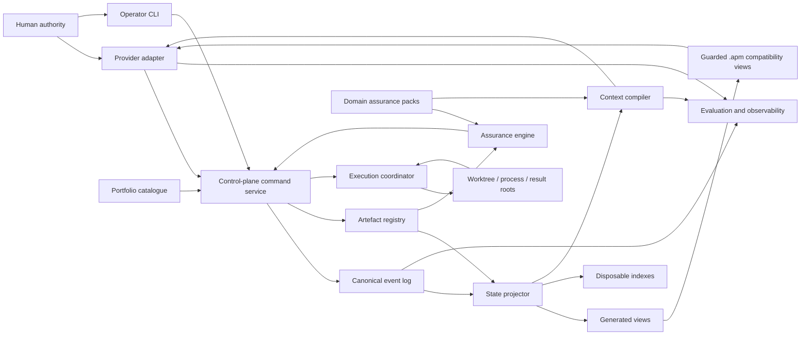

# W1 — Agentic Research System Architecture

**Date:** 2026-06-28  
**Revised:** 2026-06-30  
**Status:** Accepted under P-027; P-026 gate split remains binding<br>
**Specification version:** 0.3  
**Design authority:** `00-master-transition-plan.md`, W0 manifest and 2026-06-29 addendum, D-001–D-008, P-001–P-005, and approved amendments P-020–P-027<br>
**Implementation authority:** None; this document defines boundaries and does not authorize implementation or migration  
**Review owners:** Stephen and the current research-programme Manager  

## Review record

- **Stephen:** Approved on 2026-06-28 with the instruction to proceed to W2.
- **Review gate:** Passed under P-027 on Stephen's 2026-06-30 confirmation that W1 had been reviewed and passed.
- **Adversarial review:** `accept_with_required_changes` at `33ab053e`; dispositions approved and integrated through the 2026-06-29 reconciliation.
- **Post-T1.28 reconciliation:** The 2026-06-29 W0 addendum records active incomplete execution; final closeout reconciliation remains pending.

## 1. Decision summary

The Agentic Research System (ARS) will be an evolutionary successor to APM, not a second orchestration framework layered beside it indefinitely. Its core will be local, provider-neutral, inspectable, and recoverable from version-controlled records.

The architecture makes five binding choices, subject to this specification's review gate:

1. Append-only JSONL records and immutable artefact manifests are canonical in one dedicated project control store with a protected linear history. Task-worktree branches never contain independently writable ledgers. SQLite, graph/search indexes, dashboards, Tracker, and bus files are rebuildable projections.
2. One project-wide control-plane command service serializes accepted state changes and allocates the global event position/hash chain. Agents, hooks, adapters, Workers, and task worktrees submit commands; they do not edit canonical state directly.
3. Research outputs stay in their established domain locations. ARS records identity, provenance, validation, review, and decision links without copying large results into the control plane.
4. Provider runtimes and domain-specific assurance logic are adapters or packs around a provider- and domain-neutral core. `CLAUDE.md`, `AGENTS.md`, hooks, and skills are not canonical policy.
5. Legacy APM tasks remain governed by `.apm/` until their declared closeout boundary. Successor-owned tasks may expose namespaced compatibility views, but never share a mutable legacy task/report slot or dual canonical write authority.

These choices preserve APM's useful task-bus simplicity and research controls while removing mutable single-slot state, implicit identity, provider drift, and dependence on session memory.

## 2. Sources and evidence

This architecture implements:

- `00-master-transition-plan.md`: system principles, target architecture, options, and transition programme;
- `01-current-system-evidence.md`: context overload, state/projection mismatch, single-slot bus, main-checkout/worktree split, provider-policy drift, scientific-independence gap, and absent harness evals;
- `02-design-and-deliverables-roadmap.md`: W1 component, state, trust, filesystem, index, dependency, and compatibility requirements;
- `03-decisions-and-open-questions.md`: accepted directions D-001–D-008 and bounded decisions Q-001–Q-007;
- `transition/W0-legacy-closeout-transition-manifest-2026-06-28.md`: dated legacy boundary, source precedence, no-migration set, unresolved Stage 2 scope, and fixtures F-001–F-020;
- `transition/W0-legacy-closeout-transition-addendum-2026-06-29.md`: current T1.6/T1.28 anchors and pending A-001/A-002 status;
- `reviews/adversarial-first-pass-review-2026-06-29.md` and its reconciliation: required changes M-1–M-10 and approved amendments P-020–P-025;
- the supplied context-engineering material: separation of instructions, knowledge, memory, examples, tools, guardrails, event history, working context, tests, and evals;
- the supplied agentic-SDLC material: specification-first work, explicit orchestration/execution boundaries, durable artefact handoff, and harness evaluation.

The existing Graphify index was queried for the current APM control plane but returned Stage 1 computational nodes rather than control documentation. No architecture claim below relies on that retrieval. Direct repository files and the commit-anchored W0 inventory are authoritative.

## 3. Scope

### 3.1 In scope

- component ownership and dependency direction;
- canonical records and projected state;
- command, event, artefact, review, and decision boundaries;
- portfolio, control-plane, execution, assurance, context/memory, evaluation, and runtime-adapter components;
- local filesystem ownership and optional indexes;
- trust boundaries and fail-closed behavior;
- compatibility with legacy `.apm/` tasks and views;
- architectural constraints for W2–W10.

### 3.2 Deferred to later specifications

- exact identifiers, schemas, transition tables, leases, retries, and idempotency keys: W2;
- retrieval ranking, token budgets, consolidation, and memory confidence: W3;
- role permissions, model thresholds, and independence rules by risk tier: W4;
- assurance-pack schema and result-to-claim procedure: W5;
- trace schema, fixture format, graders, and metric thresholds: W6;
- Claude and Codex adapter mappings and parity tests: W7;
- resource claims, heartbeats, checkpoints, and operator commands: W8;
- import mechanics, pilot, rollback, and deprecation schedule: W9;
- reusable initialization and operations templates: W10.

### 3.3 Non-goals

- a distributed service, cloud scheduler, or general workflow engine in the first release;
- replacement of Git, research code, result JSONs, paper folders, vaults, or external-data controls;
- automatic methodological approval, claim promotion, or pre-registration amendment;
- retrospective normalization of every APM Tracker sentence;
- model downgrading for mathematical work without task-class eval evidence;
- migration of T1.28, T0.3, unresolved Stage 2 tasks, or provenance-sensitive legacy files during W1.

## 4. Architectural model

ARS is a modular monolith with ports and adapters. “Modular” means each component owns one kind of state and exposes a narrow interface. “Monolith” means the first release runs as local repository tooling with one serialized command boundary, not as independently deployed services.



The arrows show allowed dependency or data-flow direction. They do not imply that every box is a separate process.

## 5. Component catalogue

### 5.1 Portfolio catalogue

**Single responsibility:** Represent research programmes and the dependency graph among questions, hypotheses, datasets, methods, estimands or mathematical objects, studies, papers, and claims.

**Owns:** Stable portfolio-object definitions, declared dependencies, promotion gates, and links to current evidence state. It does not own task execution status or numerical results.

**Consumes:** Accepted decisions and artefact references from the control plane.

**Produces:** Candidate work, dependency queries, gate requirements, and portfolio views.

**Consumers:** Research Designer, Portfolio Steward, context compiler, task authoring, and dashboards.

**Boundary:** Portfolio state may say that a claim depends on an accepted result; it cannot declare that result accepted. Acceptance authority comes from control-plane events and reviews.

All portfolio mutations that affect active lifecycle state are submitted through the command service. The catalogue cannot bypass authority checks by editing a generated portfolio view.

### 5.2 Control-plane command service

**Single responsibility:** Validate commands and serialize authoritative lifecycle changes into append-only events.

**Owns:** Command validation, actor and authority checks, concurrency control, event append, and references to schema versions. It is the only writer of canonical events.

**Consumes:** Commands from humans, provider adapters, the execution coordinator, assurance engine, compatibility importer, and deterministic hooks.

**Produces:** Accepted or rejected command receipts and immutable events.

**Consumers:** State projector, evaluation/observability, audit, context compiler, and compatibility views.

**Boundary:** A model message, task report, hook result, or filesystem change is evidence submitted to the service, not a state transition by itself. Rejected commands are retained as operational trace where privacy rules permit, but do not enter the authoritative event stream as successful transitions.

### 5.3 State projector and query service

**Single responsibility:** Deterministically reduce canonical events and artefact-validation records into current state and queryable views.

**Owns:** Projector code, projection version, rebuild checkpoints, and generated read models.

**Consumes:** Canonical event log and artefact registry.

**Produces:** Current task, attempt, review, decision, resource, portfolio-link, and queue projections.

**Consumers:** Humans, dashboards, context compiler, runtime adapters, compatibility adapter, and evaluation system.

**Boundary:** A projection can be deleted and rebuilt without loss. Manual edits to a projection are drift, not authority, and must be overwritten or rejected on the next rebuild.

### 5.4 Artefact and provenance registry

**Single responsibility:** Identify durable outputs and record their lineage, integrity, validation, confidentiality, and consumers.

**Owns:** Small immutable manifests and validation/supersession links. It does not own the underlying large file.

**Consumes:** Artefact-registration commands, hashes, result paths, code commits, environment fingerprints, input identities, contract results, and review links.

**Produces:** Resolvable artefact identities and provenance chains.

**Consumers:** Control plane, assurance engine, context compiler, reproducibility tooling, claim review, migration, and audit.

**Boundary:** Existing `results/`, `papers/`, contract, vault, and external-data locations retain their domain ownership. A manifest references them. Secrets, raw restricted data, and `.env` contents are never copied into control-plane records.

### 5.5 Execution coordinator

**Single responsibility:** Turn an authorized dispatch into a bounded execution attempt and report execution facts back to the control plane.

**Owns:** Attempt launch protocol, declared roots, runtime handle, heartbeat/checkpoint linkage, and stop/pause/resume requests. Detailed resource policy belongs to W8.

**Consumes:** Authorized dispatches, agent profile, context packet reference, resource grant, worktree/branch allocation, stop conditions, and output namespace.

**Produces:** Attempt lifecycle commands, process/checkpoint evidence, and candidate artefact registrations.

**Consumers:** Workers, operations agents, state projector, assurance engine, and operator UI.

**Boundary:** It does not decide research validity or acceptance. A process exit code and passing software tests can complete an execution attempt but cannot accept a research task.

### 5.6 Assurance engine

**Single responsibility:** Evaluate submitted work against governing machine-checkable controls and coordinate independent review obligations.

**Owns:** Assurance-plan references, validation outcomes, proof-obligation status, review requirements, and assurance-pack execution records.

**Consumes:** Governing pre-registration or design lock, contract versions, artefact manifests, test results, domain-pack rules, and reviewer verdicts.

**Produces:** Validation evidence, review requests, exceptions, and accept/reject/Partial recommendations submitted as commands.

**Consumers:** Control plane, Independent Verifier, Claim Reviewer, context compiler, and evaluation system.

**Boundary:** The engine may establish structural conformance but does not collapse scientific judgment into schema validation. R2/R3 acceptance requires the authority topology defined in W4/W5. An implementer cannot activate and solely approve the governing contract for its own producing run.

### 5.7 Context compiler and memory curator

**Single responsibility:** Assemble bounded, role-specific, source-linked working context and maintain reviewed durable memory as a distinct information class.

**Owns:** Context-packet manifests, compilation policy version, retrieval explanation, omission record, and memory-consolidation proposals.

**Consumes:** Projected state, canonical source references, artefact manifests, policy, role profile, domain packs, skills, examples, and optional retrieval indexes.

**Produces:** Immutable context packet references, retrieval traces, and memory proposals requiring the review policy defined in W3.

**Consumers:** Provider adapters, agents, independent reviewers, session recovery, and evaluation/observability.

**Boundary:** Event history, current state, durable memory, and turn context remain distinct. A summary or memory cannot supersede a governing decision or result. An unavailable or stale optional index reduces convenience; it cannot change source precedence.

### 5.8 Evaluation and observability service

**Single responsibility:** Record and assess system behavior across outcomes, trajectories, scientific quality, and operations.

**Owns:** Trace references, eval runs, fixture versions, grader results, calibration state, and aggregate metrics.

**Consumes:** Events, command receipts, context manifests, adapter metadata, validation records, tool traces allowed by privacy policy, and historical fixtures.

**Produces:** Regression evidence, change gates, incident records, and operational/scientific metrics.

**Consumers:** System maintainers, model-routing policy, adapter release process, assurance owners, and Stephen.

**Boundary:** Observability data is not canonical research evidence unless separately registered as an artefact and reviewed. Evaluation can block a system change; it cannot silently rewrite a research decision.

### 5.9 Runtime adapter layer

**Single responsibility:** Translate a provider runtime's instructions, tools, permissions, hooks, skills, and messages to and from stable ARS ports.

**Owns:** Provider mapping, generated instruction surfaces, semantic coverage declarations, and runtime-specific recovery glue.

**Consumes:** Canonical policy, agent profile, context packet, dispatch, and runtime capabilities.

**Produces:** Provider-specific configuration, tool calls, normalized commands, and trace metadata.

**Consumers:** Claude, Codex, future supported runtimes, control plane, context compiler, and eval service.

**Boundary:** `CLAUDE.md`, `AGENTS.md`, `.claude/settings*.json`, Codex configuration, and provider hook scripts are generated or validated delivery surfaces. None is the sole source of a safeguard. Runtime-specific additions must be represented as declared extensions and cannot weaken canonical policy.

### 5.10 Legacy APM compatibility adapter

**Single responsibility:** Preserve a controlled interoperability surface for `.apm/` while legacy work closes and selected clients still expect task/report files.

**Owns:** Ownership registry, import/export cursors, idempotency hashes, generated compatibility files, and divergence diagnostics.

**Consumes:** ARS projections for successor-owned tasks and explicitly registered legacy bus messages for legacy-owned tasks.

**Produces:** Human-readable task/report views, imported commands, and drift/conflict reports.

**Consumers:** Existing APM Manager/Worker procedures, humans, migration tooling, and W9 pilot evaluation.

**Boundary:** It is an adapter, not a second control plane. Its ownership modes and write rules are specified in section 10.

### 5.11 Domain assurance packs

**Single responsibility:** Extend the core with domain-specific objects, checks, examples, and review questions without changing core lifecycle semantics.

**Owns:** Versioned domain schemas and assurance definitions, such as TDA topology/representation/null controls or social-research panel/estimand/provenance controls.

**Consumes:** Stable assurance and context interfaces.

**Produces:** Domain validation evidence and context fragments.

**Consumers:** Assurance engine, Research Designer, context compiler, Independent Verifier, and eval fixtures.

**Boundary:** Packs cannot append events, accept tasks, select their own approver, or bypass core authority rules.

## 6. Canonical state and projections

### 6.1 Canonical records

ARS has two classes of authority:

1. **System-native authority:** append-only events, immutable object definitions, artefact manifests, policy versions, schema versions, and signed or attributed review/decision records.
2. **Externally owned research authority:** committed pre-registrations, contracts, code, result files, manuscripts, vault decisions, external-data manifests, and Git history referenced by identity and hash.

The event log records lifecycle facts about externally owned artefacts; it does not absorb or replace their contents. Corrections create supersession or amendment events and preserve the original record.

### 6.2 Projected state

The following are non-authoritative and rebuildable:

- current-state JSON or YAML views;
- queue and inbox views;
- registered ARS-namespaced task/report compatibility views for successor-owned tasks;
- Tracker-like status pages and paper dashboards;
- SQLite databases;
- full-text, vector, graph, or GraphRAG indexes;
- cached context search results;
- rendered HTML or terminal dashboards;
- summaries and session handoffs unless promoted through a reviewed memory event.

Every projection records its source event position and projector version. A view that cannot state those values is informational only and must not authorize a transition.

### 6.3 Canonical storage decision

Q-001 is resolved by P-001/P-020 as follows: JSONL is canonical; SQLite is an optional disposable projection. Complete current state rebuilds from one dedicated versioned ledger and referenced artefact manifests without SQLite or any task-worktree branch.

One project-wide control-plane command service owns the control-store lock, validates the expected global tail and affected stream versions, atomically publishes one event batch, and returns a receipt. The dedicated ledger has one protected linear history. It is never merged from task branches, rebased, reset, or corrected by reverting event files; corrections are compensating events. Worktrees reach it only through the command port. W2 defines transaction and recovery details without introducing per-worktree writers.

## 7. Filesystem and index boundaries

### 7.1 Proposed provider-neutral root

Q-002 is resolved by P-002/P-020 by retaining the working name **Agentic Research System** while separating tracked installed definitions from dynamic project authority:

```text
code repository (present in normal worktrees)
  .research-system/
    config/          # project identity and stable control-store binding
    schemas/         # versioned core interface schemas
    policies/        # provider-neutral policy and authority rules
    packs/            # reviewed domain-pack declarations
    evals/           # fixture definitions and accepted catalogue metadata
    adapters/        # adapter definitions and semantic coverage declarations
    projections/     # generated, disposable views
    indexes/         # disposable SQLite/search/graph indexes
    runtime/         # ignored local client caches and endpoint handles

dedicated project control root (not a task-worktree branch)
  objects/           # immutable portfolio/control objects
  events/            # append-only event batches in one linear history
  manifests/         # accepted artefact/provenance manifests
  receipts/          # immutable command receipts and idempotency evidence
  snapshots/         # verified replay anchors and audit exports
  runtime/           # writer lock, service identity, cursors, process handle
```

The code repository tracks the first group. The dedicated control root is bound by `project_id`, store identity, path/URI, service endpoint, and expected tail identity; it is the sole dynamic canonical store. Its default durable implementation is a dedicated Git repository or equivalently versioned linear store owned by the command service. It is never copied into or advanced by task worktrees. `projections`, `indexes`, and both runtime directories are non-canonical. Accepted eval results may be registered in the control store; raw sensitive traces and caches are not.

### 7.2 Research artefact roots

Research files remain where their domain workflow expects them:

- code in source packages and scripts;
- results and checkpoints in established results locations;
- contracts and binding tests in their existing repositories or an installed assurance pack;
- manuscripts in paper directories;
- permanent narrative decisions in the research vault where required;
- restricted source data outside reusable templates and public packages.

The registry stores paths relative to a declared root where possible, plus hashes and root identity. It records separate control, code, result, cache, and external-data roots plus `project_id`, control-store identity, service endpoint, and expected tail. Root resolution from the current working directory is prohibited, so a worktree cannot silently redirect control or result authority.

### 7.3 Optional indexes

SQLite, graph, vector, and full-text indexes implement query acceleration only. Each index declares:

- source event position and manifest set;
- builder and schema version;
- creation time;
- completeness and staleness state;
- deletion and rebuild command.

If an index conflicts with direct canonical records, canonical records win. If index freshness cannot be proven for an R2/R3 dispatch, the context compiler either rebuilds it or retrieves from direct sources and records the degraded path.

## 8. Dependency rules

The core dependency direction is strict:

```text
provider runtime -> provider adapter -> core ports
legacy APM       -> compatibility adapter -> core ports
domain pack      -> assurance/context extension ports
operator         -> command port

command service  -> canonical event and manifest stores
canonical stores -> projector -> views and indexes
projector/index  -> context compiler -> immutable context packet
dispatch         -> execution coordinator -> external worktree/process
external output  -> artefact registry -> assurance -> review/decision command
all traces       -> evaluation and observability
```

Prohibited reverse dependencies:

- core policy must not import provider instruction files;
- canonical events must not depend on SQLite, dashboards, Graphify, or vector search;
- domain packs must not modify core state machines;
- execution code must not mutate task state or approve results directly;
- context summaries must not overwrite source evidence;
- `.apm/` compatibility files must not become authoritative for successor-owned tasks;
- evaluation must not alter accepted research artefacts;
- portfolio promotion must not infer acceptance from prose status alone.

This dependency direction allows any provider, index, dashboard, pack, or compatibility view to be replaced without changing authoritative history.

## 9. Trust boundaries and authority

### 9.1 Human authority boundary

Stephen remains the final authority for pre-registration changes, R3 dispatch, decision-lock reversal, claim promotion, and upgrading imported evidence from provisional to authoritative. The current Manager may accept R0/R1 and R2 work within an explicit authority grant; R2 acceptance requires its independent verification set. The Manager cannot broaden methodological scope or exercise a P-005 transition. This preserves genuine human gates without routing routine reversible work through Stephen.

### 9.2 Agent boundary

Model output is untrusted input until validated and attributed. Agent identity includes role profile, actual model/version, reasoning setting where exposed, provider, session, context packet, and tool permissions. A role label alone grants no authority.

### 9.3 Deterministic-tool boundary

Hooks, schemas, tests, and scripts are trusted only for their declared assertions. Passing a JSON schema does not establish a correct estimand; passing unit tests does not establish a valid null model; a hash establishes identity, not scientific adequacy.

### 9.4 Independent-review boundary

For R2/R3 work, governing design, implementation, scientific verification, and acceptance are distinct authorities. Independence is graded evidence, not a role label: records identify actor, session, role, model family/version, context manifest, trace-visibility policy, subject hash, and producing-attempt relationship. A verifier inspects the exact subject artefact but does not inherit implementer conclusions or hidden reasoning. In a solo programme this provides contextual/model independence, not independent human authorities. R2 requires a distinct verifier context plus Manager acceptance; R3 requires cross-family/cross-context review plus Stephen.

### 9.5 Filesystem and process boundary

Worktrees, subprocesses, caches, and external tools are outside canonical control-plane state. They receive explicit capabilities and roots. Their existence, exit status, or file writes are observations that must be registered and validated.

### 9.6 External data and secrets boundary

Restricted data, credentials, provider tokens, and `.env` contents never enter events, context packets, eval fixtures, or generated adapters. Records contain opaque references, access class, and verification evidence. Public project templates must work without TDL data paths.

### 9.7 Projection and index boundary

A projection or index may be stale, incomplete, corrupted, or manually edited. It is never sufficient evidence for an irreversible action. Commands requiring current state use an expected event position and fail on mismatch.

### 9.8 Adapter boundary

Provider and APM adapters are semi-trusted translators. Their output is schema-validated, their policy coverage is evaluated, and their commands pass the same authority checks as direct CLI commands. Adapter failure cannot corrupt canonical records.

## 10. `.apm/` compatibility architecture

### 10.1 Ownership modes

Every bridged task has exactly one mode:

| Mode | Canonical authority | Adapter behavior |
|---|---|---|
| `legacy_owned` | Existing `.apm/` files plus W0 source precedence | ARS observes and may import explicitly accepted events; it does not write the task, report, Tracker, log, contract, result, branch, or worktree |
| `successor_owned` | ARS canonical events and manifests | Adapter may generate registered ARS-namespaced views that legacy tooling cannot write; ARS-aware acknowledgements/reports return as idempotent commands |
| `closed_reference` | Frozen legacy evidence | Read-only source links; no active synchronization |

There is no `dual_owned` mode.

### 10.2 Guarded view behavior

A successor-owned task never uses the mutable legacy `task.md` or `report.md` slot. Its compatibility views live at registered ARS-namespaced paths that unmodified APM tooling does not write. If a legacy Worker must use the legacy slot, the Task remains `legacy_owned` until explicit cutover.

The adapter may write a namespaced view only when:

- the target path is registered to that task, message, and recipient identity;
- the existing file is empty or carries the same generated ownership marker and expected projection version;
- the source event position and content hash are included;
- write and import cursors make replay idempotent;
- a conflict produces a diagnostic and stops rather than choosing a winner.

Human-readable task and report views remain useful. Their content is rendered from typed records, and clearing an ARS-aware view acknowledges that named projection rather than deleting history. Hooks may block accidental writes but are defence-in-depth; they do not make a shared legacy path safe.

### 10.3 Legacy import behavior

Legacy imports preserve source path, commit or hash, observed time, import time, source authority class, and uncertainty. The adapter does not infer `accepted` from `Success`, `Done`, a merged section, or an empty bus alone. W0 source precedence governs conflicts until W9 defines the final mapping.

### 10.4 T1.28 and current legacy work

T1.28, T0.3, remaining Plan-defined Stage 2 work, retained worktrees, superseded-but-live results, caches, and external UKDA data remain in the W0 no-migration set. W1 does not create `.research-system/`, adapter files, or imported state for them.

The 2026-06-29 W0 addendum records T1.28 as active and incomplete. After T1.28 reaches a reviewed terminal disposition, W0 receives another addendum and W1 is reconciled again before acceptance. Reconciliation checks for new control-plane, authority, resource, and compatibility constraints; T1.28 history is never rewritten to match this design.

## 11. Core workflows

### 11.1 New task to accepted evidence

1. Portfolio or human authority proposes work with dependencies and risk signals.
2. Research design and governing rules are locked at the required authority level.
3. A task command references the design, expected artefacts, assurance plan, Partial criteria, and resource envelope.
4. The command service emits the task and readiness events.
5. The context compiler builds a bounded packet and manifest.
6. Routing selects an evaluated agent profile; the execution coordinator creates an attempt with explicit roots.
7. The Worker produces candidate artefacts and execution evidence.
8. The registry records manifests; deterministic controls and independent review produce assurance evidence.
9. The authorized reviewer accepts, rejects, requests input, or records Partial without erasing the attempt.
10. Portfolio and claim views update from the accepted event; compatibility and dashboard projections rebuild.

At no point does a report file, process exit, or manuscript edit alone complete the task.

### 11.2 Partial, blocked, and interrupted work

Useful artefacts can be registered even when a task ends Partial or blocked. The terminal or suspended state records the unmet obligation, responsible authority, resume condition, valid checkpoints, and prohibited claim. A later attempt references rather than overwrites the earlier attempt.

### 11.3 Policy or provider change

Canonical policy changes first. Adapters are regenerated or updated, semantic parity tests run, and relevant historical fixtures are evaluated. A provider upgrade or model change is allowed only for the task classes covered by its passing eval profile. Existing research decisions are unaffected.

## 12. Failure containment and recovery

| Failure | Required behavior |
|---|---|
| Command validation or authority failure | Reject without lifecycle mutation; return a reason and retained receipt |
| Concurrent or stale command | Reject on expected-position mismatch; caller refreshes and resubmits intentionally |
| Interrupted event write | Atomic append leaves either the old valid stream or one complete new event; recovery never guesses partial content |
| Corrupt or missing projection/index | Delete and rebuild from canonical records; block actions that required freshness until rebuilt |
| Context compilation conflict | Emit no dispatch; surface conflicting sources and required authority |
| Provider/adapter outage | Preserve queued state; no fallback model below the task's evaluated risk threshold |
| Execution crash | Retain attempt, process evidence, checkpoints, and candidate outputs; resume or supersede explicitly |
| Assurance failure | Preserve artefacts as rejected or Partial evidence; block acceptance and claim promotion |
| Compatibility-file collision | Stop adapter write/import and create a divergence diagnostic; never overwrite either message |
| Missing external artefact | Mark reference unresolved and block dependent transitions; do not silently drop lineage |
| Secret or restricted-data detection | Refuse registration/context inclusion and emit a sanitized security incident record |

Recovery always proceeds from canonical records plus verified external artefacts. Session transcripts and model memory are aids, not recovery authority.

## 13. Security and permissions

The first release uses least-privilege local capabilities:

- read access is scoped by declared control, code, result, cache, paper, vault, and data roots;
- write access is scoped by role and attempt, with unique output namespaces and non-overwrite rules;
- event append is available only through the command boundary;
- policy, schema, pack, and adapter changes require code review and eval gates;
- external network, data-service, and publication actions require explicit capability and human authority;
- raw prompts, traces, and outputs are retained only under the privacy rules established in W6;
- generated views visibly declare that they are projections and state their freshness.

The system is not a security sandbox by itself. It coordinates and audits the sandbox and permission mechanisms supplied by Claude, Codex, the operating system, and repository tooling.

## 14. Architectural invariants

1. Every accepted state transition has a stable identity, actor, time, reason, and source position.
2. Complete current state is reconstructible without a database, provider session, dashboard, or mutable bus file.
3. Exactly one canonical owner exists for every active task.
4. No generated view can authorize its own source transition.
5. No agent edits canonical events directly.
6. No provider-specific instruction or hook file is the sole source of policy.
7. No domain pack changes core lifecycle or grants authority.
8. No execution success implies scientific acceptance.
9. No R2/R3 implementer solely approves its governing design or contract.
10. No result, checkpoint, report, or correction overwrites its predecessor silently.
11. Context packets identify their sources, versions, selection policy, omissions, and conflicts.
12. Restricted data and secrets remain outside canonical records and reusable fixtures.
13. Optional indexes are disposable and disclose freshness.
14. Compatibility collisions fail closed.
15. Legacy history remains governed by its original authority until an explicit cutover event.
16. One project-wide writer allocates every global event position; task worktrees never advance canonical history.
17. A successor-owned compatibility path is never shared with an unmodified legacy writer.
18. Independence claims are derived from recorded context/model/actor evidence rather than attestation alone.

## 15. Historical fixture coverage required of this architecture

W1 must make the W0 failure corpus representable even though W2/W6 define exact fixtures.

| W0 fixtures | Architectural control |
|---|---|
| F-001, F-002 | Stable task/dispatch/attempt identity; append-only events; separate queue and review projections |
| F-003 | Explicit control, code, result, cache, and external-data roots in execution/context records |
| F-004, F-005, F-006 | Deterministic projections with source position and drift diagnostics |
| F-007, F-008, F-009 | Execution coordinator, resource policy port, typed stop/input-required/Partial transitions |
| F-010, F-011, F-012, F-013 | Artefact lineage, stage-bounded corrections, frozen representation and data-vintage assurance packs |
| F-014 | Independent authority boundary for R2/R3 contract activation and acceptance |
| F-015, F-016, F-017, F-018, F-019 | Independent scientific review and conservative result-to-claim promotion |
| F-020 | Canonical provider-neutral policy, evaluated adapters, and semantic parity gates |
| F-021, F-022, F-023, F-024 | Governing-amendment inclusion, checkable reviewer independence, attributed approval, and qualitative lifecycle boundary |
| S-011–S-016 | Writer crash, branch divergence, adapter rejection, backup/restore, supersession-cycle, and provider-outage controls |

No fixture requires a distributed framework. Each can be exercised against local command, event, projection, adapter, and context interfaces.

## 16. Verification strategy for W1

### 16.1 Structural checks

- every required component has one responsibility, owned state, inputs, outputs, consumers, and a boundary;
- canonical and projected records are exhaustively classified at this level;
- every write path reaches canonical state through the command service;
- every optional index can be removed without loss;
- dependency arrows contain no provider-to-core or projection-to-canonical inversion;
- `.apm/` ownership modes exclude dual authority;
- W0 fixtures map to an architectural control.

### 16.2 Design scenarios

W2/W6 must later mechanize these scenarios:

1. Two tasks dispatched to one Worker remain separately queryable and neither assignment is overwritten.
2. Two task worktrees submit concurrently to one project command service; the service allocates distinct global positions in the dedicated control store and neither worktree writes canonical files.
3. A stale Tracker or paper dashboard is detected and rebuilt from accepted events.
4. A result passes schema validation but fails independent scientific review and cannot become accepted.
5. A context index is stale; direct retrieval succeeds and records the degraded path.
6. Claude is unavailable for an R3 review; the task waits rather than silently routing to an unevaluated model.
7. An unmodified legacy Worker targets `task.md`; a successor-owned projection uses a separate namespaced path and cannot collide with the legacy slot.
8. The SQLite index and all generated views are deleted; current state rebuilds exactly from the dedicated ledger, verified manifests, and any accepted snapshot anchor.
9. A Partial attempt registers valid diagnostic artefacts without promoting a decision or claim.
10. A domain pack is removed; core history remains readable and identifies the missing pack version.
11. A verifier receives the subject artefact but not the implementer's conclusion/hidden reasoning; context provenance proves the required independence grade.
12. A producer emits a scientific passed flag from a degenerate fallback; independent recomputation fails the fixture.
13. An R0 reversible command uses the minimal envelope without bypassing append-only history.

### 16.3 Research-assurance classification

W1 itself touches Output/Provenance and Paper Claim governance lanes and defines interfaces for all other assurance lanes. It introduces no formula, estimand, null model, topological result, or paper claim. Its scientific review question is: **Do the authority and dependency boundaries prevent structurally valid but scientifically invalid work from being accepted or promoted?**

## 17. Consequences and trade-offs

### 17.1 Benefits

- Human-readable local operation survives while history stops depending on mutable mailboxes.
- Provider and model changes become testable adapter changes rather than silent workflow changes.
- Context can be bounded without losing source traceability.
- Scientific and software acceptance remain explicitly separate.
- Recovery is based on durable events and artefacts rather than a particular chat.
- TDA-specific rigor can be reused without hard-coding TDA into the project-management core.

### 17.2 Costs

- Event, manifest, and adapter schemas add initial design and maintenance work.
- A serialized command boundary is more formal than directly editing Markdown.
- Compatibility requires temporary namespaced views, explicit cutover ownership, and conflict diagnostics.
- Independent review increases latency for R2/R3 work.
- Provider parity and harness evals become release obligations.

These costs are intentional responses to observed failures. The design avoids the larger operational cost of distributed services, autonomous scheduling, or complete historical normalization.

## 18. Constraints passed to later work packages

### W2

Define typed commands and events around the project-wide single-writer boundary and dedicated control store; stable IDs; expected-position concurrency; attempts; reviews; decisions; Partial/blocking states; supersession; artefact manifests; verified-snapshot replay; and projection freshness.

### W3

Keep history, projected state, durable memory, and working context distinct. Make context packets immutable and source-linked. Optional retrieval indexes cannot be authority.

### W4

Represent authority, capability, actual model metadata, checkable independence grade, delegated acceptance, and risk ceiling in profiles. Routing must fail closed when no evaluated profile satisfies the task.

### W5

Define domain-pack ports and two-key research validity. Machine validation and scientific acceptance remain separate records.

### W6

Test outcomes and trajectories across all W0 fixture classes and reserved F-021–F-024/S-011–S-016 cases. Preserve privacy boundaries, require independent scientific-property grading, and distinguish operational trace from research evidence.

### W7

Generate or validate provider surfaces from canonical policy. Prove semantic coverage; refuse destructive synchronization from a poorer source.

### W8

Implement explicit roots, resource grants, process/checkpoint evidence, guardrails, pause/resume, and orphan recovery through core commands.

### W9

Implement the three APM ownership modes, selective import, non-shared namespaced compatibility views, rollback, and post-T1.28 reconciliation. Never introduce dual canonical writes or route successor-owned work through an unmodified legacy Worker.

### W10

Package the modular monolith and extension interfaces without TDL paths, TDA assumptions, external data, or provider-specific canonical policy.

## 19. W1 review gate

W1 moved from `review_pending` to `accepted` under P-027. The accepted review criteria are:

- [x] The component catalogue is complete at architecture level and every component has one responsibility and explicit consumers.
- [x] A dedicated linear JSONL ledger owned by one project-wide writer, plus disposable SQLite/search/graph projections, is the correct local-first boundary.
- [x] `.research-system/` is accepted for tracked definitions and a stable binding to the dedicated dynamic control root.
- [x] The project-wide command writer, protected ledger history, explicit worktree submission path, and root-binding rule are acceptable.
- [x] Research artefacts remain externally owned and are referenced rather than duplicated.
- [x] Trust boundaries preserve human authority and separate software, structural, scientific, and claim approval.
- [x] Provider files, hooks, skills, dashboards, indexes, Tracker, and bus files are non-canonical.
- [x] Dependency direction prevents adapters, projections, packs, and Workers from mutating core authority.
- [x] The three `.apm/` ownership modes and non-shared successor paths preserve legacy work without dual writes.
- [x] P-026 correctly separates the non-migrating greenfield-foundation gate from T1.28 closeout, while no active legacy task is migrated by this design.
- [x] W0 fixtures F-001–F-020 and reserved F-021–F-024/S-011–S-016 are representable by the architecture.
- [x] The constraints passed to W2–W10 are correctly bounded.

Until that review is recorded, W1 is a normative design proposal but not implementation authority.

## 20. W1 outcome

**Outcome:** `ACCEPTED — foundation implementation still prohibited pending the remaining P-026 downstream gates; legacy migration prohibited pending final post-T1.28 reconciliation`.

W2 v0.3 and the W6 v0.2 initial catalogue are also accepted under P-027. W3 is the current review-pending deliverable under P-026. A greenfield-foundation implementation plan may proceed only after accepted W3–W5 and frozen foundation-critical W6–W8 gates; legacy migration remains separately blocked by W0/T1.28 closeout.
