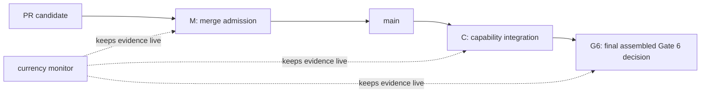

# Proposed P-049 - Gate 6 control model

**Status:** Proposed - requires Stephen's explicit adoption and a hosting-path
choice before any GitHub ruleset, branch-protection, repository-transfer, or
workflow-policy change is applied.
**Repository subject:** `main` `9fb53f53cf9984a1ac4809962cd033d9ac1b597d`
(PR #248).
**Live-state observation:** GitHub and Jira settings/statuses were read on
2026-08-13. They are external observations, not bytes content-addressed by the
repository subject above.
**Feasibility correction (2026-08-13):** `stephendor/TDL` is a public,
user-owned repository. GitHub documents merge queues as available only to
organisation-owned repositories, so the original merge-queue mechanism cannot
be installed here. Do not add a dormant `merge_group` trigger or claim a fresh
merge-queue candidate until Stephen elects to transfer the repository to an
organisation and GitHub confirms that capability.
**Scope:** first-release merge control, capability integration control, and
final Gate 6 closure control.
**Does not authorize:** provider invocation, credential handling, pilot or
research execution, result/claim promotion, live restore cutover, KAN-69
transition work, WP6.7, or Gate 7-9 work.

## Decision requested

Adopt one small control model:

1. **Merge admission** decides whether a reviewed change may enter `main`.
2. **Capability integration** decides whether a named end-to-end capability may
   be marked `INTEGRATED` in Jira.
3. **Gate 6 closure** decides whether the first-release programme capability is
   complete.
4. **Currency monitoring** is a continuously running control that detects a
   disabled or stale required workflow. It is evidence for the first three
   decisions; it is not a fourth completion gate.

No plan, schema, test harness, PR, CodeRabbit thread, review report, or Jira
transition is itself one of those decisions. It is evidence for a named
decision only.

## Governing boundaries

P-042 remains the first-release authority: ARS records an operator-mediated
external session but does not invoke providers or handle credentials. P-047
keeps the consumed Research Methods obligations inside their owning WP6
capabilities. P-048 establishes the narrow C-1 currency control and expressly
does **not** establish branch protection, a full-suite policy, or Gate 6
closure.

This proposal does not alter accepted historical bytes. In particular,
SCALE-01 v1.0.3 and D-G6-5 remain accepted for their exact subject only. A
future current preflight must be a new immutable **eligibility envelope**, not
an edit to those records and not a replacement package.

The accepted WP6.6 dossier-admission profile also remains non-dispatchable. Its
`dispatchable: false` means the act of admitting the dossier cannot invoke or
authorize provider execution. It is not the status of the later Gate 6
eligibility envelope. A Gate 6 eligibility envelope may make a pilot *eligible*
for a separately authorized operator-mediated dispatch without starting the
pilot or changing the WP6.6 admission profile.

## The three decisions

### M - Merge admission

**Question:** may this exact reviewed PR head, composed with current `main`,
merge?

The answer is **yes** only when all of the following are true:

1. The PR names its canonical Jira capability and the observable outcome it
   changes. A job or subtask is not enough.
2. Direct checks that exercise changed production behaviour pass on their
   declared, recorded subject. The C-1 currency check is deliberately a
   GitHub-generated **merge-candidate** check (`GITHUB_REF`), not a claim of
   exact-PR-head evidence; before it is required it must record its resolved
   merge-candidate SHA. Exact-head evidence and review remain separate
   requirements below. A broad suite is added only where an explicit gate or
   changed shared seam requires it.
3. Once remote enforcement is active, both of these current-candidate controls
   pass:
   - `contract-and-session-currency`, the bounded C-1/cross-seam check; and
   - `require-active-currency-workflow`, a PR-run independent liveness check.
   A missing check, skipped liveness job, or non-pass fails closed and blocks
   admission.
   Neither control is proof that every change is correct.
4. Every actionable review finding is resolved on the current exact PR head.
5. A capability, Gate, recovery, durable-mutation, or decision/control PR has
   a current external-review conclusion. Stephen chooses and triggers the
   reviewer; agents do not trigger, poll, or self-certify it. A rate limit or
   pending review is not a conclusion. Routine lower-risk work may be merged
   without external review only when Stephen explicitly chooses that path.
6. This is a solo-owner repository. Stephen makes the final merge decision.
   For a review-required PR, its exact head, review conclusion, and any valid
   remediation must be visible in GitHub before Stephen merges. No agent may
   merge a PR unless Stephen's current instruction names that exact PR and
   authorizes the merge.

`merge admitted` means only that the change may enter `main`. It never means
the named capability, a Gate, or the programme is complete.

### C - Capability integration

**Question:** is the named capability complete through its real public or
production seam?

The answer is **yes** only when the exact capability has:

1. a real positive path from a legitimate start state to its durable result;
2. direct negative proof for the irreversible or corrupting failures named by
   its contract;
3. proportional regression evidence for each changed shared seam;
4. required final independent review and Stephen's acceptance where the
   capability contract requires them;
5. an integrated exact subject whose local, upstream, and live remote `main`
   identities agree; and
6. no remaining implementation work inside that named capability.

Only then can the canonical Jira capability issue become `Done` with
`Capability status: INTEGRATED`. Intermediate PRs, foundations, contracts,
plans, and reviews remain typed milestones or evidence, never an unqualified
completion state.

### G6 - Gate 6 closure

**Question:** may KAN-12 be marked complete as the first-release Gate 6
capability?

The answer is **yes** only after one final assembled candidate binds and proves
all of the following together:

1. WP6.1 remains integrated at the final assembled public lifecycle seam
   (KAN-65 / PR #243 evidence).
2. WP6.4 remains integrated at the owner-operated brief-out/evidence-back,
   restart/replay, backup, and restore-verification seam (KAN-57 / PR #242
   evidence).
3. WP6.6's real Discovery genesis and non-mutating TDA-scale dossier admission
   remain integrated (KAN-59 / PR #248 evidence). That admission proves its
   operation did not write; it does not itself grant an OS- or
   capability-enforced read-only pilot root.
4. A **new immutable SCALE-01 eligibility envelope** consumes, rather
   than rewrites, the accepted WP6.6 expected-set identity, final cardinality,
   dossier-admission result, and registered roots. It is an **eligibility
   envelope**, not a package: its schema permits only exact identities/hashes
   of the already admitted package, admission event, and root-grant evidence,
   plus the narrow eligibility verdict. It must not add, replace, or supply a
   package member. Those are explicit pre-registered expected values/invariants,
   not values inferred or rewritten at run time. An unset value, unavailable
   root or grant, mismatch, skipped check, or non-pass fails closed and leaves
   KAN-12 `INCOMPLETE`. Changing an expected baseline requires a new envelope
   and fresh exact-subject review and owner reapproval. The envelope is not
   added back into the already accepted dossier expected set, so the two
   artifacts cannot form a content-address cycle. Before it can return
   `dispatchable: true`, each input root must have an OS- or capability-enforced
   read-only grant/mount bound by exact identity; the old write-capable checkout
   is not sufficient. The negative selection must prove that a writable,
   missing, substituted, or expired root grant fails closed without issuing the
   eligibility verdict. The envelope retains `execution_authorized: false` and
   preserves the provider-free boundary. It does not mutate v1.0.3, D-G6-5, or
   WP6.6 admission bytes.
5. One named final Gate 6 assembled test selection exercises the coupled public
   seams and the new eligibility envelope's decisive tamper/no-partial-state
   negatives.
   It includes `tools/certify_wp6_6_real_dossier.ps1` (or an accepted exact
   equivalent) against the designated real roots with
   `TDL_REQUIRE_REAL_DOSSIER=1`. Missing roots, a real-dossier skip, or a
   non-pass fails G6 closed. It is run once at final candidate head. A broad
   repository suite is not a substitute for this selection.
6. One fresh independent exact-subject review covers the assembled candidate,
   including the new eligibility envelope. Stephen then makes one final Gate 6 owner
   decision over that exact subject.

The final decision may accept the new eligibility envelope and assembled evidence together;
it must not manufacture a separate review/acceptance loop merely because the
eligibility envelope exists. D-G6-5 remains historical acceptance of v1.0.3,
not a shortcut around the new exact subject.

`dispatchable: true` at G6 means only that the governed eligibility envelope makes
SCALE-01 eligible for a later, separately authorized operator-mediated pilot
dispatch. It does not create a provider call, launch an external session,
execute research, or change `execution_authorized: false`. Those remain a
subsequent owner action outside Gate 6 closure. This is the precise
reconciliation of the historical Gate 6 definition with the accepted WP6.6
non-dispatchable dossier-admission boundary.

Passing G6 is a readiness decision only. It does not start a pilot, execute a
provider call, accept returned research content, or authorize a result or
claim.

## Currency monitor

The current monitor remains exactly the P-048 C-1 control. The repository
workflow configuration is read at the immutable repository subject above; its
run status and GitHub workflow state below are live observations made on
2026-08-13:

| Control | Trigger encoded in repository subject | Live observation (2026-08-13) | What it proves | What it does not prove |
| --- | --- | --- | --- | --- |
| `ARS Artefact Currency` | PRs and pushes to `main` | `contract-and-session-currency` passed for `9fb53f53` | the selected 06i/WP6.4 contracts and direct cross-seam tests still run | broad repository health, WP6.6 correctness, or Gate 6 closure |
| `ARS Artefact Currency Watchdog` | pushes to `main`, daily, manual | `require-active-currency-workflow` passed for `9fb53f53` | GitHub reported the named currency workflow active at that observation | that its selected tests are sufficient for an unrelated change |

The disabled repository-wide `CI` workflow is not a current green gate. Its
comment claiming post-merge currency authority must be corrected when this
proposal is adopted; it cannot be made required until a real, bounded green
baseline exists.

## Current Gate 6 register

The statuses and GitHub configuration in this table are live observations as at
2026-08-13, not claims that Jira/GitHub state is content-addressed by
`9fb53f53`.

| Canonical object / immutable evidence | Live observed state (2026-08-13) | Consequence |
| --- | --- | --- |
| KAN-65 / WP6.1; PR #243 evidence | `INTEGRATED` | prerequisite evidence, not an open work lane |
| KAN-57 / WP6.4; v1.0.3/D-G6-5 accepted bytes | `INTEGRATED` | predecessor preflight stays immutable and non-dispatchable |
| KAN-59 / WP6.6; PR #248 evidence | `INTEGRATED` | supplies frozen expected-set/admission evidence; that dossier profile remains non-dispatchable |
| KAN-61 / Jira capability-control milestone | `[MILESTONE DONE]`; the residual `Blocks` edge `10194` to KAN-12 is explicitly labelled `link-reconciliation-required` and non-authoritative in KAN-61 | no open WP6.7 delivery remains; remove the stale structured edge before final KAN-12 transition rather than treating it as a revived functional blocker |
| KAN-12 / Gate 6 | `INCOMPLETE — NOT RUNNABLE` | the final capability has no current eligibility-envelope entry point, assembled proof, fresh independent review, or owner closure decision; construction may begin, but Gate 6 itself is not runnable |
| GitHub `main` configuration | no branch protection and no ruleset | no remote control currently prevents an unreviewed direct merge |

The real remaining functional gap is therefore singular:

> **Construct and prove a new immutable eligibility envelope that binds the
> integrated WP6.6 admission and read-only root grants, then prove the assembled
> public seam through one final review and owner decision. The envelope may make
> a pilot eligible; the pilot is not executed. Until that envelope has a real
> public seam, Gate 6 is NOT RUNNABLE.**

This is one capability campaign under KAN-12. Its eligibility-envelope construction,
direct testing, review, and owner decision are implementation/evidence within
that campaign, not independently completable successor lanes.

## Jira operation

KAN-12 is the only canonical open Gate 6 capability. Its description must be
updated now to remove the false statement that WP6.6 is still under
construction and to name the singular functional gap above.

KAN-61 is already a completed milestone, not a missing Gate 6 capability. Its
residual `Blocks` relation to KAN-12 is an acknowledged stale Jira projection;
before KAN-12 is transitioned, remove that edge in the Jira UI and read both
endpoints back. This is a small Jira-coherence action, not a reopened WP6.7
delivery lane.

After this proposal is adopted, create one visible child job under KAN-12:

> **[CAPABILITY DELIVERY] Complete final Gate 6 eligibility envelope and assembled
> readiness proof**

That job owns the whole remaining positive path. Do not create separate Jira
tickets for eligibility-envelope mechanics, test harnesses, review administration, or
handoffs. Review and final owner acceptance are closure evidence on the same
campaign. The job stays `In Progress` only while its production path is
actively being executed; otherwise it is `To Do` or `Owner-blocked` with the
exact next action.

The final KAN-12 description must retain this strict order:

1. capability state;
2. completed end-to-end path;
3. exact remaining functional gap;
4. next production action;
5. owner-only action, if one exists.

## Remote enforcement feasibility and choice

This section is deliberately not yet applied. GitHub currently reports both
`main` branch protection and repository rulesets absent. It also reports that
this repository is public and owned by a user account rather than an
organisation.

GitHub's current merge-queue documentation limits the feature to public
organisation repositories and private organisation repositories on Enterprise
Cloud. It is therefore unavailable to this repository as it stands. The
original proposal's `merge_group` trigger, queue rule, and queue probe are not
deployable controls here; a dormant trigger would only create a false sense of
coverage.

This is a **solo-owner repository**. GitHub does not let a pull-request author
approve their own pull request, so a required peer approval or required
`CODEOWNERS` approval would deadlock Stephen-authored work. Do not invent a
second team, commit a placeholder owner, or add a bypass to disguise that
deadlock.

The honest current division of control is:

- GitHub can mechanically require a PR, current passing checks, resolved review
  conversations, and no direct or force-push route into `main` once a suitable
  ruleset is applied.
- For review-required changes, Stephen selects an external review service or
  reviewer, waits for its conclusion, and personally decides whether to merge.
  An automated review is evidence for that decision, not an imaginary peer
  approval.
- Agents may prepare and remediate PRs, but cannot merge them without Stephen's
  current explicit authorization for that exact PR.

The independently useful first step is still valid on this repository: both
currency controls run on every PR to `main`; the watchdog queries the active
state of the currency workflow and fails closed if it cannot obtain an active
result; and each job records its resolved checkout SHA, ref, and event in the
run summary. This is PR-time liveness evidence. It is **not** a fresh
merge-candidate guarantee.

Ordinary PR checks are snapshots: GitHub does not automatically create a new PR
check merely because an owner later disables a workflow. A user-owned GitHub
repository has no native merge-queue event to invalidate that snapshot at merge
time. A scheduled watchdog can detect the condition later, but cannot honestly
be represented as atomic merge admission.

### Required owner choice

**Path A — transfer `stephendor/TDL` to an organisation.** This is the path if
a fresh, GitHub-generated merge candidate is a non-negotiable requirement.
After the transfer and a read-back confirming merge-queue availability, the
control can add `merge_group` triggers to both jobs, obtain fresh PR and
merge-queue runs, and install one `main` ruleset with a required merge queue,
resolved conversations, strict required currency checks from GitHub Actions
integration `15368`, no direct-push bypass, and non-fast-forward protection.
The resulting harmless probe must demonstrate direct-push rejection,
missing/failing check rejection, unresolved-thread rejection, both checks on a
fresh merge-group candidate, and force-push rejection (or record the exact
safe-probe limitation).

**Path B — keep the repository user-owned.** A normal PR ruleset can provide
valuable partial control, but it cannot satisfy this proposal's fresh
merge-candidate/liveness-at-merge claim. It must therefore be described as a
bounded PR-admission control only. Selecting this path requires a separately
approved external or owner-operated merge-time control design; this proposal
does not invent one or silently downgrade the Gate 6 claim.

The required checks are intentionally **not** legacy `CI`, a coverage target,
or a CodeRabbit status. They are small current baselines. A review service is
not a required GitHub check because availability and rate limits are external
to the repository; a rate limit must never be misrepresented as review success.
For a review-required PR, Stephen's recorded review conclusion and personal
merge decision are the additional evidence. No bypass actor is proposed.

## Adoption sequence

1. Stephen accepts or amends this solo-owner model and the review threshold:
   external review is required by default for capability, Gate, recovery,
   durable-mutation, and decision/control PRs; routine low-risk work remains a
   Stephen-controlled exception.
2. Directly prove the PR-time currency controls: both jobs must complete on one
   fresh PR, the watchdog must observe the currency workflow as active, and both
   run summaries must record their resolved subject. This does not enable a
   ruleset or establish merge-time invalidation.
3. Stephen chooses Path A (organisation transfer) or Path B (user-owned
   repository with an explicitly bounded alternative). Do not install a
   merge-queue rule, `merge_group` trigger, or ruleset that claims fresh
   merge-candidate liveness before that choice.
4. For Path A, read back organisation ownership and merge-queue availability,
   then add the `merge_group` controls, prove fresh PR and queue results, apply
   the ruleset, and perform the complete harmless probe stated above. For Path
   B, bring the separately approved merge-time control design back to this
   proposal before treating remote enforcement as adopted.
5. Add the concise solo-owner merge-authority rule to `AGENTS.md`, add accepted
   P-049 to the decision register, point the historical WP6 Gate
   6 plan at this live model, and correct the stale disabled-CI comment.
6. Reconcile the KAN-61 edge, read both Jira endpoints back, and create the
   single final-capability child job described above.
7. Launch that capability campaign. Do not launch a separate plan/review
   campaign first.

## Evidence consulted

- P-042, P-047, and P-048 in
  `docs/plans/agentic-research-system/03-decisions-and-open-questions.md`.
- `06g-wp6-owner-operated-session-amendment.md`.
- KAN-12, KAN-57, KAN-59, KAN-61, and KAN-65 read back on 2026-08-13.
- PR #248 merge `9fb53f53cf9984a1ac4809962cd033d9ac1b597d` and its two passing
   current-main controls.
- `.github/workflows/ars-artefact-currency.yml` and
  `.github/workflows/ars-artefact-currency-watchdog.yml`.
- `tools/certify_wp6_6_real_dossier.ps1` and
  `tests/research_system/integration/test_wp6_6_dossier_admission.py`.
- GitHub's documented merge-queue behaviour and availability: `merge_group`
  checks run on a fresh queue candidate, but the queue is available only to
  organisation-owned repositories; this public user-owned repository is not
  eligible until an owner-approved transfer changes that fact.
- `.research-system/contracts/wp6-4/tda-scale-v1.0.3/scale01-gate6-preflight.json`;
  it correctly remains historical and `pending_wp6_6`.
