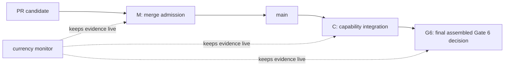

# Proposed P-049 - Gate 6 control model

**Status:** Proposed - requires Stephen's explicit adoption before any GitHub
ruleset, branch-protection, or workflow-policy change is applied.
**Repository subject:** `main` `9fb53f53cf9984a1ac4809962cd033d9ac1b597d`
(PR #248).
**Live-state observation:** GitHub and Jira settings/statuses were read on
2026-08-13. They are external observations, not bytes content-addressed by the
repository subject above.
**Scope:** first-release merge control, capability integration control, and
final Gate 6 closure control.
**Does not authorize:** provider invocation, credential handling, pilot or
research execution, result/claim promotion, live restore cutover, KAN-69
transition work, WP6.7, or Gate 7-9 work.

## Decision requested

Adopt one small control model:

1. **Merge admission** decides whether a reviewed change may enter `main`.
2. **Capability integration** decides whether a named end-to-end capability may
   be marked `INTEGRATED` in Jira.
3. **Gate 6 closure** decides whether the first-release programme capability is
   complete.
4. **Currency monitoring** is a continuously running control that detects a
   disabled or stale required workflow. It is evidence for the first three
   decisions; it is not a fourth completion gate.

No plan, schema, test harness, PR, CodeRabbit thread, review report, or Jira
transition is itself one of those decisions. It is evidence for a named
decision only.

## Governing boundaries

P-042 remains the first-release authority: ARS records an operator-mediated
external session but does not invoke providers or handle credentials. P-047
keeps the consumed Research Methods obligations inside their owning WP6
capabilities. P-048 establishes the narrow C-1 currency control and expressly
does **not** establish branch protection, a full-suite policy, or Gate 6
closure.

This proposal does not alter accepted historical bytes. In particular,
SCALE-01 v1.0.3 and D-G6-5 remain accepted for their exact subject only. A
future current preflight must be a new immutable successor, not an edit to
those records.

The accepted WP6.6 dossier-admission profile also remains non-dispatchable. Its
`dispatchable: false` means the act of admitting the dossier cannot invoke or
authorize provider execution. It is not the status of the later Gate 6
preflight. A Gate 6 preflight may make a pilot *eligible* for a separately
authorized operator-mediated dispatch without starting the pilot or changing
the WP6.6 admission profile.

## The three decisions

### M - Merge admission

**Question:** may this exact reviewed PR head, composed with current `main`,
merge?

The answer is **yes** only when all of the following are true:

1. The PR names its canonical Jira capability and the observable outcome it
   changes. A job or subtask is not enough.
2. Direct checks that exercise changed production behaviour pass on their
   declared, recorded subject. The C-1 currency check is deliberately a
   GitHub-generated **merge-candidate** check (`GITHUB_REF`), not a claim of
   exact-PR-head evidence; before it is required it must record its resolved
   merge-candidate SHA. Exact-head evidence and review remain separate
   requirements below. A broad suite is added only where an explicit gate or
   changed shared seam requires it.
3. Once remote enforcement is active, both of these current-candidate controls
   pass:
   - `contract-and-session-currency`, the bounded C-1/cross-seam check; and
   - `require-active-currency-workflow`, a PR-run independent liveness check.
   A missing check, skipped liveness job, or non-pass fails closed and blocks
   admission.
   Neither control is proof that every change is correct.
4. Every actionable review finding is resolved on the current exact PR head.
   Stephen controls whether and when CodeRabbit or another external reviewer is
   used; agents do not trigger, poll, or self-certify it.
5. Stephen records the final approval in GitHub after considering the required
   external review. A review of an earlier commit does not approve a later
   commit.

`merge admitted` means only that the change may enter `main`. It never means
the named capability, a Gate, or the programme is complete.

### C - Capability integration

**Question:** is the named capability complete through its real public or
production seam?

The answer is **yes** only when the exact capability has:

1. a real positive path from a legitimate start state to its durable result;
2. direct negative proof for the irreversible or corrupting failures named by
   its contract;
3. proportional regression evidence for each changed shared seam;
4. required final independent review and Stephen's acceptance where the
   capability contract requires them;
5. an integrated exact subject whose local, upstream, and live remote `main`
   identities agree; and
6. no remaining implementation work inside that named capability.

Only then can the canonical Jira capability issue become `Done` with
`Capability status: INTEGRATED`. Intermediate PRs, foundations, contracts,
plans, and reviews remain typed milestones or evidence, never an unqualified
completion state.

### G6 - Gate 6 closure

**Question:** may KAN-12 be marked complete as the first-release Gate 6
capability?

The answer is **yes** only after one final assembled candidate binds and proves
all of the following together:

1. WP6.1 remains integrated at the final assembled public lifecycle seam
   (KAN-65 / PR #243 evidence).
2. WP6.4 remains integrated at the owner-operated brief-out/evidence-back,
   restart/replay, backup, and restore-verification seam (KAN-57 / PR #242
   evidence).
3. WP6.6's real Discovery genesis and read-only TDA-scale dossier admission
   remain integrated (KAN-59 / PR #248 evidence).
4. A **new immutable SCALE-01 package/preflight successor** consumes, rather
   than rewrites, the accepted WP6.6 expected-set identity, final cardinality,
   dossier-admission result, and registered read-only roots. Those are explicit
   pre-registered expected values/invariants, not values inferred or rewritten
   at run time. An unset value, unavailable root, mismatch, skipped check, or
   non-pass fails closed and leaves KAN-12 `INCOMPLETE`. Changing an expected
   baseline requires a new successor and fresh exact-subject review and owner
   reapproval. The successor is not added back into the already accepted dossier
   expected set, so the two artifacts cannot form a content-address cycle. It
   makes the controlled pilot `dispatchable: true` in the narrow
   operator-mediated eligibility sense, retains `execution_authorized: false`,
   and preserves the provider-free boundary. It does not mutate v1.0.3, D-G6-5,
   or WP6.6 admission bytes.
5. One named final Gate 6 assembled test selection exercises the coupled public
   seams and the new preflight's decisive tamper/no-partial-state negatives.
   It includes `tools/certify_wp6_6_real_dossier.ps1` (or an accepted exact
   equivalent) against the designated real roots with
   `TDL_REQUIRE_REAL_DOSSIER=1`. Missing roots, a real-dossier skip, or a
   non-pass fails G6 closed. It is run once at final candidate head. A broad
   repository suite is not a substitute for this selection.
6. One fresh independent exact-subject review covers the assembled candidate,
   including the new preflight. Stephen then makes one final Gate 6 owner
   decision over that exact subject.

The final decision may accept the new preflight and assembled evidence together;
it must not manufacture a separate review/acceptance loop merely because the
preflight successor exists. D-G6-5 remains historical acceptance of v1.0.3,
not a shortcut around the new exact subject.

`dispatchable: true` at G6 means only that the governed preflight makes
SCALE-01 eligible for a later, separately authorized operator-mediated pilot
dispatch. It does not create a provider call, launch an external session,
execute research, or change `execution_authorized: false`. Those remain a
subsequent owner action outside Gate 6 closure. This is the precise
reconciliation of the historical Gate 6 definition with the accepted WP6.6
non-dispatchable dossier-admission boundary.

Passing G6 is a readiness decision only. It does not start a pilot, execute a
provider call, accept returned research content, or authorize a result or
claim.

## Currency monitor

The current monitor remains exactly the P-048 C-1 control. The repository
workflow configuration is read at the immutable repository subject above; its
run status and GitHub workflow state below are live observations made on
2026-08-13:

| Control | Trigger encoded in repository subject | Live observation (2026-08-13) | What it proves | What it does not prove |
| --- | --- | --- | --- | --- |
| `ARS Artefact Currency` | PRs and pushes to `main` | `contract-and-session-currency` passed for `9fb53f53` | the selected 06i/WP6.4 contracts and direct cross-seam tests still run | broad repository health, WP6.6 correctness, or Gate 6 closure |
| `ARS Artefact Currency Watchdog` | pushes to `main`, daily, manual | `require-active-currency-workflow` passed for `9fb53f53` | GitHub reported the named currency workflow active at that observation | that its selected tests are sufficient for an unrelated change |

The disabled repository-wide `CI` workflow is not a current green gate. Its
comment claiming post-merge currency authority must be corrected when this
proposal is adopted; it cannot be made required until a real, bounded green
baseline exists.

## Current Gate 6 register

The statuses and GitHub configuration in this table are live observations as at
2026-08-13, not claims that Jira/GitHub state is content-addressed by
`9fb53f53`.

| Canonical object / immutable evidence | Live observed state (2026-08-13) | Consequence |
| --- | --- | --- |
| KAN-65 / WP6.1; PR #243 evidence | `INTEGRATED` | prerequisite evidence, not an open work lane |
| KAN-57 / WP6.4; v1.0.3/D-G6-5 accepted bytes | `INTEGRATED` | predecessor preflight stays immutable and non-dispatchable |
| KAN-59 / WP6.6; PR #248 evidence | `INTEGRATED` | supplies frozen expected-set/admission evidence; that dossier profile remains non-dispatchable |
| KAN-61 / Jira capability-control milestone | `[MILESTONE DONE]`; the residual `Blocks` edge `10194` to KAN-12 is explicitly labelled `link-reconciliation-required` and non-authoritative in KAN-61 | no open WP6.7 delivery remains; remove the stale structured edge before final KAN-12 transition rather than treating it as a revived functional blocker |
| KAN-12 / Gate 6 | `INCOMPLETE` | final capability is now runnable, but has no current preflight successor, assembled proof, fresh independent review, or owner closure decision |
| GitHub `main` configuration | no branch protection and no ruleset | no remote control currently prevents an unreviewed direct merge |

The real remaining functional gap is therefore singular:

> **Complete the final Gate 6 capability by binding the integrated WP6.6
> admission as an immutable input to a new governed, pilot-eligible preflight,
> then prove the assembled public seam through one final review and owner
> decision. The preflight is eligible; the pilot is not executed.**

This is one capability campaign under KAN-12. Its preflight construction,
direct testing, review, and owner decision are implementation/evidence within
that campaign, not independently completable successor lanes.

## Jira operation

KAN-12 is the only canonical open Gate 6 capability. Its description must be
updated now to remove the false statement that WP6.6 is still under
construction and to name the singular functional gap above.

KAN-61 is already a completed milestone, not a missing Gate 6 capability. Its
residual `Blocks` relation to KAN-12 is an acknowledged stale Jira projection;
before KAN-12 is transitioned, remove that edge in the Jira UI and read both
endpoints back. This is a small Jira-coherence action, not a reopened WP6.7
delivery lane.

After this proposal is adopted, create one visible child job under KAN-12:

> **[CAPABILITY DELIVERY] Complete final Gate 6 preflight and assembled
> readiness proof**

That job owns the whole remaining positive path. Do not create separate Jira
tickets for preflight mechanics, test harnesses, review administration, or
handoffs. Review and final owner acceptance are closure evidence on the same
campaign. The job stays `In Progress` only while its production path is
actively being executed; otherwise it is `To Do` or `Owner-blocked` with the
exact next action.

The final KAN-12 description must retain this strict order:

1. capability state;
2. completed end-to-end path;
3. exact remaining functional gap;
4. next production action;
5. owner-only action, if one exists.

## Proposed remote enforcement

This section is deliberately not yet applied. GitHub currently reports both
`main` branch protection and repository rulesets absent.

The original single-owner `CODEOWNERS` draft (`* @stephendor`) is rejected: it
cannot approve a Stephen-authored PR and would make those PRs permanently
unmergeable under the proposed no-bypass rule. Do **not** enforce this model
until Stephen names a second, eligible human maintainer/team with repository
review permission. The production `CODEOWNERS` entry must name both real
identities; do not commit a placeholder.

Before enforcement, make the currency controls enforceable:

1. retain the merge-candidate subject of `contract-and-session-currency` and
   record the resolved SHA in its run output/artifact;
2. extend the independent watchdog to run on PRs as well as `main`/schedule,
   and ensure its required job cannot become a successful skipped result; and
3. obtain one fresh successful PR run for both controls from GitHub Actions.

Only then install one active `main` ruleset with:

1. pull requests required; no direct-push bypass;
2. one approving review, stale approvals dismissed, and approval required from
   someone other than the last pusher;
3. all review conversations resolved;
4. code-owner approval for all repository paths from the two-or-more real
   maintainers in `CODEOWNERS`;
5. strict required status checks (the branch must be up to date with `main`),
   including `contract-and-session-currency` from GitHub Actions integration
   ID `15368` and `require-active-currency-workflow` from that same integration
   ID `15368`; and
6. non-fast-forward pushes blocked.

The required checks are intentionally **not** legacy `CI`, a coverage target,
or a CodeRabbit status. They are small current baselines. The exact capability
test selection and Stephen's external-review decision remain explicit merge
evidence on the PR. No bypass actor is proposed; Stephen retains control by
approving and merging a reviewed PR rather than by bypassing the control.

## Adoption sequence

1. Stephen accepts or amends this proposed model, names the second eligible
   maintainer/team, and approves the exact remote ruleset.
2. Implement and directly prove the two currency-control prerequisites above;
   do not enable the ruleset until both required contexts have fresh, non-skipped
   GitHub Actions results from integration ID `15368`.
3. Add the real `CODEOWNERS` identities and apply the ruleset; verify with one
   harmless branch/PR probe that an owner-authored PR cannot self-approve and
   that both required controls are enforced.
4. Add accepted P-049 to the decision register, point the historical WP6 Gate
   6 plan at this live model, and correct the stale disabled-CI comment.
5. Reconcile the KAN-61 edge, read both Jira endpoints back, and create the
   single final-capability child job described above.
6. Launch that capability campaign. Do not launch a separate plan/review
   campaign first.

## Evidence consulted

- P-042, P-047, and P-048 in
  `docs/plans/agentic-research-system/03-decisions-and-open-questions.md`.
- `06g-wp6-owner-operated-session-amendment.md`.
- KAN-12, KAN-57, KAN-59, KAN-61, and KAN-65 read back on 2026-08-13.
- PR #248 merge `9fb53f53cf9984a1ac4809962cd033d9ac1b597d` and its two passing
   current-main controls.
- `.github/workflows/ars-artefact-currency.yml` and
  `.github/workflows/ars-artefact-currency-watchdog.yml`.
- `tools/certify_wp6_6_real_dossier.ps1` and
  `tests/research_system/integration/test_wp6_6_dossier_admission.py`.
- `.research-system/contracts/wp6-4/tda-scale-v1.0.3/scale01-gate6-preflight.json`;
  it correctly remains historical and `pending_wp6_6`.
