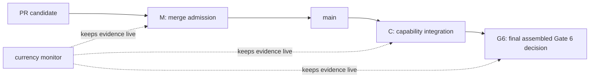

# P-049 - Gate 6 control model

**Status:** Adopted and live for merge admission. The remaining Gate 6
eligibility-envelope capability is active under KAN-12 / KAN-103 and is not
closed by P-049.
**Repository subject:** `main` `d64c58fa4366e5d7a0b7ddc5b2e0519edafcffd7`
(PR #248).
**Live-state observation:** GitHub and Jira settings/statuses were read on
2026-08-13. They are external observations, not bytes content-addressed by the
repository subject above.
**Owner hosting action (2026-08-13):** Stephen transferred `stephendor/TDL`
to public organisation `ZK-Theory`; the live repository is now
`ZK-Theory/TDL`. This selects Path A below. GitHub Actions is enabled, both
currency workflows are active, and active ruleset `20822054` (`P-049 Gate 6
main merge admission`) requires a pull request, the merge queue, the required
currency checks, and non-fast-forward protection. These are live observations,
not bytes content-addressed by the repository subject.
**Scope:** first-release merge control, capability integration control, and
final Gate 6 closure control.
**Does not authorize:** provider invocation, credential handling, pilot or
research execution, result/claim promotion, live restore cutover, KAN-69
transition work, WP6.7, or Gate 7-9 work.

## Decision requested

Adopt one small control model:

1. **Merge admission** decides whether a reviewed change may enter `main`.
2. **Capability integration** decides whether a named end-to-end capability may
   be marked `INTEGRATED` in Jira.
3. **Gate 6 closure** decides whether the first-release programme capability is
   complete.
4. **Currency monitoring** is a continuously running control that detects a
   disabled or stale required workflow. It is evidence for the first three
   decisions; it is not a fourth completion gate.

No plan, schema, test harness, PR, CodeRabbit thread, review report, or Jira
transition is itself one of those decisions. It is evidence for a named
decision only.



## Governing boundaries

P-042 remains the first-release authority: ARS records an operator-mediated
external session but does not invoke providers or handle credentials. P-047
keeps the consumed Research Methods obligations inside their owning WP6
capabilities. P-048 establishes the narrow C-1 currency control and expressly
does **not** establish branch protection, a full-suite policy, or Gate 6
closure.

This proposal does not alter accepted historical bytes. In particular,
SCALE-01 v1.0.3 and D-G6-5 remain accepted for their exact subject only. A
future current preflight must be a new immutable **eligibility envelope**, not
an edit to those records and not a replacement package.

The accepted WP6.6 dossier-admission profile also remains non-dispatchable. Its
`dispatchable: false` means the act of admitting the dossier cannot invoke or
authorize provider execution. It is not the status of the later Gate 6
eligibility envelope. A Gate 6 eligibility envelope may make a pilot *eligible*
for a separately authorized operator-mediated dispatch without starting the
pilot or changing the WP6.6 admission profile.

## The three decisions

### M - Merge admission

**Question:** may this exact reviewed PR head, composed with current `main`,
merge?

The answer is **yes** only when all of the following are true:

1. The PR names its canonical Jira capability and the observable outcome it
   changes. A job or subtask is not enough.
2. Direct checks that exercise changed production behaviour pass on their
   declared, recorded subject. The C-1 currency check is deliberately a
   GitHub-generated **merge-candidate** check (`GITHUB_REF`), not a claim of
   exact-PR-head evidence; before it is required it must record its resolved
   merge-candidate SHA. Exact-head evidence and review remain separate
   requirements below. A broad suite is added only where an explicit gate or
   changed shared seam requires it.
3. Once remote enforcement is active, both of these current-candidate controls
   pass:
   - `contract-and-session-currency`, the bounded C-1/cross-seam check; and
   - `require-active-currency-workflow`, a PR-run independent liveness check.
   A missing check, skipped liveness job, or non-pass fails closed and blocks
   admission.
   Neither control is proof that every change is correct.
4. Every actionable review finding is resolved on the current exact PR head.
5. A capability, Gate, recovery, durable-mutation, or decision/control PR has
   a current external-review conclusion. Stephen chooses and triggers the
   reviewer; agents do not trigger, poll, or self-certify it. A rate limit or
   pending review is not a conclusion. Routine lower-risk work may be merged
   without external review only when Stephen explicitly chooses that path.
6. This is a solo-owner repository. Stephen makes the final merge decision.
   For a review-required PR, its exact head, review conclusion, and any valid
   remediation must be visible in GitHub before Stephen merges. No agent may
   merge a PR unless Stephen's current instruction names that exact PR and
   authorizes the merge.

`merge admitted` means only that the change may enter `main`. It never means
the named capability, a Gate, or the programme is complete.

### C - Capability integration

**Question:** is the named capability complete through its real public or
production seam?

The answer is **yes** only when the exact capability has:

1. a real positive path from a legitimate start state to its durable result;
2. direct negative proof for the irreversible or corrupting failures named by
   its contract;
3. proportional regression evidence for each changed shared seam;
4. required final independent review and Stephen's acceptance where the
   capability contract requires them;
5. an integrated exact subject whose local, upstream, and live remote `main`
   identities agree; and
6. no remaining implementation work inside that named capability.

Only then can the canonical Jira capability issue become `Done` with
`Capability status: INTEGRATED`. Intermediate PRs, foundations, contracts,
plans, and reviews remain typed milestones or evidence, never an unqualified
completion state.

### G6 - Gate 6 closure

**Question:** may KAN-12 be marked complete as the first-release Gate 6
capability?

The answer is **yes** only after one final assembled candidate binds and proves
all of the following together:

1. WP6.1 remains integrated at the final assembled public lifecycle seam
   (KAN-65 / PR #243 evidence).
2. WP6.4 remains integrated at the owner-operated brief-out/evidence-back,
   restart/replay, backup, and restore-verification seam (KAN-57 / PR #242
   evidence).
3. WP6.6's real Discovery genesis and non-mutating TDA-scale dossier admission
   remain integrated (KAN-59 / PR #248 evidence). That admission proves its
   operation did not write; it does not itself grant an OS- or
   capability-enforced read-only pilot root.
4. A **new immutable SCALE-01 eligibility envelope** consumes, rather
   than rewrites, the accepted WP6.6 expected-set identity, final cardinality,
   dossier-admission result, and registered roots. It is an **eligibility
   envelope**, not a package: its schema permits only exact identities/hashes
   of the already admitted package, admission event, and root-grant evidence,
   plus the narrow eligibility verdict. It must not add, replace, or supply a
   package member. Those are explicit pre-registered expected values/invariants,
   not values inferred or rewritten at run time. An unset value, unavailable
   root or grant, mismatch, skipped check, or non-pass fails closed and leaves
   KAN-12 `INCOMPLETE`. Changing an expected baseline requires a new envelope
   and fresh exact-subject review and owner reapproval. The envelope is not
   added back into the already accepted dossier expected set, so the two
   artifacts cannot form a content-address cycle. Before it can return
   `dispatchable: true`, each input root must have an OS- or capability-enforced
   read-only grant/mount bound by exact identity; the old write-capable checkout
   is not sufficient. The negative selection must prove that a writable,
   missing, substituted, or expired root grant fails closed without issuing the
   eligibility verdict. The envelope retains `execution_authorized: false` and
   preserves the provider-free boundary. It does not mutate v1.0.3, D-G6-5, or
   WP6.6 admission bytes.

   The capability-enforced alternative is narrow: the public preflight must
   issue sealed read-only application capabilities for the exact registered
   roots and pass only those capabilities into dossier admission. A JSON
   `capability_read_only` label, or an otherwise writable root passed directly
   to admission, is not enforcement. This is not a claim that the owner’s
   filesystem ACL is read-only; it restricts the Gate 6 preflight itself to
   the granted read operation.
5. One named final Gate 6 assembled test selection exercises the coupled public
   seams and the new eligibility envelope's decisive tamper/no-partial-state
   negatives.
   It includes `tools/certify_wp6_6_real_dossier.ps1` (or an accepted exact
   equivalent) against the designated real roots with
   `TDL_REQUIRE_REAL_DOSSIER=1`. Missing roots, a real-dossier skip, or a
   non-pass fails G6 closed. It is run once at final candidate head. A broad
   repository suite is not a substitute for this selection.
6. One fresh independent exact-subject review covers the assembled candidate,
   including the new eligibility envelope. Stephen delegated the final Gate 6
   readiness decision to Codex on 2026-08-14, bounded to that same exact clean
   compatible subject. This delegation does not authorize a PR merge: Stephen's
   current explicit authorization remains required for the exact PR.

The final decision may accept the new eligibility envelope and assembled evidence together;
it must not manufacture a separate review/acceptance loop merely because the
eligibility envelope exists. D-G6-5 remains historical acceptance of v1.0.3,
not a shortcut around the new exact subject.

`dispatchable: true` at G6 means only that the governed eligibility envelope makes
SCALE-01 eligible for a later, separately authorized operator-mediated pilot
dispatch. It does not create a provider call, launch an external session,
execute research, or change `execution_authorized: false`. Those remain a
subsequent owner action outside Gate 6 closure. This is the precise
reconciliation of the historical Gate 6 definition with the accepted WP6.6
non-dispatchable dossier-admission boundary.

Passing G6 is a readiness decision only. It does not start a pilot, execute a
provider call, accept returned research content, or authorize a result or
claim.

## Currency monitor

The current monitor remains exactly the P-048 C-1 control. The repository
workflow configuration is read at the immutable repository subject above; its
run status and GitHub workflow state below are live observations made on
2026-08-13:

| Control | Trigger encoded in repository subject | Live observation (2026-08-13) | What it proves | What it does not prove |
| --- | --- | --- | --- | --- |
| `ARS Artefact Currency` | PRs and pushes to `main` | `contract-and-session-currency` passed for `9fb53f53` | the selected 06i/WP6.4 contracts and direct cross-seam tests still run | broad repository health, WP6.6 correctness, or Gate 6 closure |
| `ARS Artefact Currency Watchdog` | pushes to `main`, daily, manual | `require-active-currency-workflow` passed for `9fb53f53` | GitHub reported the named currency workflow active at that observation | that its selected tests are sufficient for an unrelated change |

The disabled repository-wide `CI` workflow is not a current green gate. Its
comment claiming post-merge currency authority must be corrected when this
proposal is adopted; it cannot be made required until a real, bounded green
baseline exists.

## Current Gate 6 register

The statuses and GitHub configuration in this table are live observations as at
2026-08-14, not claims that Jira/GitHub state is content-addressed by
`d64c58fa`.

| Canonical object / immutable evidence | Live observed state (2026-08-13) | Consequence |
| --- | --- | --- |
| KAN-65 / WP6.1; PR #243 evidence | `INTEGRATED` | prerequisite evidence, not an open work lane |
| KAN-57 / WP6.4; v1.0.3/D-G6-5 accepted bytes | `INTEGRATED` | predecessor preflight stays immutable and non-dispatchable |
| KAN-59 / WP6.6; PR #248 evidence | `INTEGRATED` | supplies frozen expected-set/admission evidence; that dossier profile remains non-dispatchable |
| KAN-61 / Jira capability-control milestone | `[MILESTONE DONE]`; stale `Blocks` relation `10194` was removed on 2026-08-14 and KAN-61 now only relates to KAN-12 | records clean-up is complete; it is not revived WP6.7 work or a Gate 6 blocker |
| KAN-12 / Gate 6 | `INCOMPLETE — RUNNABLE`; KAN-103 is the one active delivery campaign | a real public `ars gate6` eligibility path and final real-dossier selection exist on the candidate branch; enforcement/isolation remediation and one admission-identity authority decision remain before final exact-subject proof, review, integration, and decision |
| GitHub `main` configuration | active ruleset `20822054`, `P-049 Gate 6 main merge admission` | PR, merge queue, required currency checks, and non-fast-forward control are live; this is merge admission, not Gate 6 closure |

The real remaining functional gap is therefore singular:

> **Issue a time-bounded immutable capability-read-only root grant for the
> accepted real dossier, bind the sealed accepted admission-event identity,
> run the final assembled real-dossier selection at the final candidate head,
> obtain one independent exact-subject review, integrate the reviewed result,
> then record Codex's delegated Gate 6 readiness decision. The envelope may
> make a pilot eligible; the pilot is not executed.**

The current WP6.6 expected-set and path-registration authority records do not
publish a durable, accepted `ResearchDossierAdmitted` event identifier or raw
hash. The preflight must not invent one by hashing a freshly reconstructed
event. Before final certification, Stephen must make one bounded authority
choice: supply the exact accepted event/receipt from the governed Discovery
ledger for the envelope to verify, or explicitly amend this P-049 requirement
to bind the accepted deterministic admission result instead. This is one
visible decision within KAN-103, not a new delivery lane or ticket.

This is one capability campaign under KAN-12. Its eligibility-envelope construction,
direct testing, review, and owner decision are implementation/evidence within
that campaign, not independently completable successor lanes.

## Jira operation

KAN-12 is the only canonical open Gate 6 capability. KAN-61's stale structured
edge was removed and read back at both endpoints on 2026-08-14. KAN-103,
**[CAPABILITY DELIVERY] Complete final Gate 6 eligibility envelope and
assembled readiness proof**, is the one active child job and owns the whole
remaining positive path. Do not create separate Jira tickets for mechanics,
test harnesses, review administration, or handoffs.

The candidate public seam is:

```powershell
ars gate6 root-grant --repository-root <candidate-root> `
  --repository-contract-root <TDL>/.research-system/contracts/wp6-4 `
  --vault-root <TDL>/vault --expires-at <owner-selected-UTC-time> `
  --output <outside-governed-roots>/scale01-root-grant.json

$env:TDL_GATE6_ROOT_GRANT = '<outside-governed-roots>/scale01-root-grant.json'
$env:TDL_GATE6_ENVELOPE_OUTPUT = '<outside-governed-roots>/scale01-eligibility-envelope.json'
tools/certify_gate6_real_dossier.ps1
```

The root grant carries only the `capability_read_only` operation over the exact
WP6.6-registered roots and expires at the named operator-selected UTC instant.
The final script first invokes `tools/certify_wp6_6_real_dossier.ps1` with
`TDL_REQUIRE_REAL_DOSSIER=1`, then runs the immutable provider-free envelope
command. It creates no provider session, pilot, research execution, or result
claim.

The final KAN-12 description must retain this strict order:

1. capability state;
2. completed end-to-end path;
3. exact remaining functional gap;
4. next production action;
5. owner-only action, if one exists.

## Remote enforcement: live control and operating boundary

Path A is now applied. `ZK-Theory/TDL` is a public organisation-owned
repository and active GitHub ruleset `20822054`, **P-049 Gate 6 main merge
admission**, requires a pull request, merge queue, required currency checks,
and non-fast-forward protection on `main`. PR #256 supplied the harmless
queue-probe integration and merged as `d64c58fa` on 2026-08-13. This is live
merge-admission control, not evidence that the Gate 6 capability is complete.

This is a **solo-owner repository**. GitHub does not let a pull-request author
approve their own pull request, so a required peer approval or required
`CODEOWNERS` approval would deadlock Stephen-authored work. Do not invent a
second team, commit a placeholder owner, or add a bypass to disguise that
deadlock.

The honest current division of control is:

- GitHub mechanically requires the ordinary P-049 PR/queue/checks path and
  prohibits non-fast-forward mutation of `main`.
- For review-required changes, Stephen selects an external review service or
  reviewer, waits for its conclusion, and personally decides whether to merge.
  An automated review is evidence for that decision, not an imaginary peer
  approval.
- Agents may prepare and remediate PRs, but cannot merge them without Stephen's
  current explicit authorization for that exact PR.

> **Historical feasibility snapshot — superseded on 2026-08-13.** The following
> pre-transfer analysis records why Path A was selected; it does not describe
> the live P-049 ruleset or current Gate 6 control.

The independently useful first step is still valid on this repository: both
currency controls run on every PR to `main`; the watchdog queries the active
state of the currency workflow and fails closed if it cannot obtain an active
result; and each job records its resolved checkout SHA, ref, and event in the
run summary. This is PR-time liveness evidence. It is **not** a fresh
merge-candidate guarantee.

Ordinary PR checks are snapshots: GitHub does not automatically create a new PR
check merely because an owner later disables a workflow. A user-owned GitHub
repository has no native merge-queue event to invalidate that snapshot at merge
time. A scheduled watchdog can detect the condition later, but cannot honestly
be represented as atomic merge admission.

### Historical hosting-path selection

**Path A — selected and completed at the hosting boundary.** Stephen
transferred the repository to public organisation `ZK-Theory` on 2026-08-13.
The live read-back confirms that `ZK-Theory/TDL` is organisation-owned, public,
and administrator-controlled by Stephen. GitHub documents merge queues as
available for this repository class. The remaining delivery work is therefore
concrete: integrate the reviewed `merge_group` workflow triggers, obtain fresh
PR and merge-queue runs, then install one `main` ruleset with a required merge
queue, resolved conversations, strict required currency checks from GitHub
Actions integration `15368`, no direct-push bypass, and non-fast-forward
protection. The resulting harmless probe must demonstrate direct-push
rejection, missing/failing check rejection, unresolved-thread rejection, both
checks on a fresh merge-group candidate, and force-push rejection (or record
the exact safe-probe limitation).

**Path B — keep the repository user-owned.** A normal PR ruleset can provide
valuable partial control, but it cannot satisfy this proposal's fresh
merge-candidate/liveness-at-merge claim. It must therefore be described as a
bounded PR-admission control only. Selecting this path requires a separately
approved external or owner-operated merge-time control design; this proposal
does not invent one or silently downgrade the Gate 6 claim.

The required checks are intentionally **not** legacy `CI`, a coverage target,
or a CodeRabbit status. They are small current baselines. A review service is
not a required GitHub check because availability and rate limits are external
to the repository; a rate limit must never be misrepresented as review success.
For a review-required PR, Stephen's recorded review conclusion and personal
merge decision are the additional evidence. No bypass actor is proposed.

## Adoption outcome and remaining sequence

1. Path A, the merge-queue workflows, the harmless probe (PR #256), ruleset
   `20822054`, the solo-owner merge rule, KAN-61 reconciliation, and KAN-103
   creation are complete.
2. KAN-103 now constructs and directly proves the one eligibility-envelope
   capability. Its root-grant, public CLI, direct negatives, and composed
   real-dossier script are implementation within that one campaign.
3. At the final candidate head, issue the operator-selected expiring grant,
   run the named final script and one selected assembled test command, obtain
   the fresh independent exact-subject review, then use ordinary P-049 PR
   admission. Codex records the delegated Gate 6 decision only after the
   reviewed exact result is integrated on `main`.

## Evidence consulted

- P-042, P-047, and P-048 in
  `docs/plans/agentic-research-system/03-decisions-and-open-questions.md`.
- `06g-wp6-owner-operated-session-amendment.md`.
- KAN-12, KAN-57, KAN-59, KAN-61, KAN-65, and KAN-103 read back on 2026-08-14.
- PR #248 merge `9fb53f53cf9984a1ac4809962cd033d9ac1b597d` and its two passing
   current-main controls.
- `.github/workflows/ars-artefact-currency.yml` and
  `.github/workflows/ars-artefact-currency-watchdog.yml`.
- `tools/certify_wp6_6_real_dossier.ps1` and
  `tests/research_system/integration/test_wp6_6_dossier_admission.py`.
- GitHub's documented merge-queue behaviour and availability: `merge_group`
  checks run on a fresh queue candidate, and the queue is available to public
  organisation-owned repositories; `ZK-Theory/TDL` now meets that boundary.
- Live hosting/ruleset read-back on 2026-08-14: `ZK-Theory/TDL` is public,
  organisation-owned, Actions-enabled, with active ruleset `20822054`; both
  currency workflows are active. PR #256 merged `d64c58fa` after the harmless
  queue probe.
- `.research-system/contracts/wp6-4/tda-scale-v1.0.3/scale01-gate6-preflight.json`;
  it correctly remains historical and `pending_wp6_6`.
